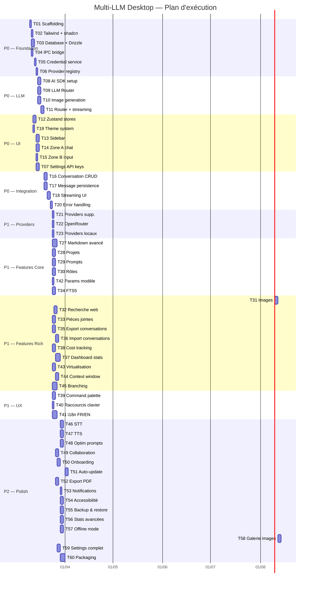

# Plan de Développement : Multi-LLM Desktop

**Date** : 2026-03-09
**Statut** : Validé
**Contexte** : [FEATURES.md](./FEATURES.md) (~475 fonctionnalités V1), [ARCH.md](./ARCH.md) (10 décisions), [STACK.md](./STACK.md) (Electron + React + TS)

---

## 1. Vue d'ensemble

### Architecture

```
┌─────────────────────────────────────────────────────────────┐
│                        Electron App                         │
│                                                             │
│  ┌───────────────────────────────────────────────────────┐  │
│  │                   RENDERER PROCESS                    │  │
│  │                                                       │  │
│  │  ┌─────────┐  ┌──────────────────┐  ┌─────────────┐  │  │
│  │  │ Sidebar │  │    Zone A        │  │  Panel       │  │  │
│  │  │ - Projets│  │    (Chat)       │  │  (Details)   │  │  │
│  │  │ - Convos │  │    Messages     │  │  (Settings)  │  │  │
│  │  │ - Nav    │  │    Streaming    │  │              │  │  │
│  │  │         │  │    Markdown     │  │              │  │  │
│  │  └─────────┘  ├──────────────────┤  └─────────────┘  │  │
│  │               │    Zone B        │                    │  │
│  │               │    (Input)       │                    │  │
│  │               │    Model select  │                    │  │
│  │               │    Attachments   │                    │  │
│  │               └──────────────────┘                    │  │
│  │                                                       │  │
│  │  Zustand Stores: conversations, messages, settings,   │  │
│  │                  ui, providers, projects               │  │
│  └───────────────────────┬───────────────────────────────┘  │
│                          │ IPC (contextBridge)               │
│  ┌───────────────────────┴───────────────────────────────┐  │
│  │                    PRELOAD SCRIPT                     │  │
│  │  contextBridge.exposeInMainWorld('api', { ... })      │  │
│  │  - invoke (request/response)                          │  │
│  │  - on/off (streaming events)                          │  │
│  └───────────────────────┬───────────────────────────────┘  │
│                          │ ipcMain.handle / webContents.send │
│  ┌───────────────────────┴───────────────────────────────┐  │
│  │                    MAIN PROCESS                       │  │
│  │                                                       │  │
│  │  ┌──────────────────────────────────────────────────┐ │  │
│  │  │           LLM Layer (Vercel AI SDK)              │ │  │
│  │  │  ┌──────────────────────────────────────────┐    │ │  │
│  │  │  │  router.ts — getModel(provider, modelId) │    │ │  │
│  │  │  │  providers.ts — config + clés safeStorage│    │ │  │
│  │  │  │  cost-calculator.ts — PRICING table      │    │ │  │
│  │  │  │  image.ts — generateImage() Gemini       │    │ │  │
│  │  │  └──────────────────────────────────────────┘    │ │  │
│  │  └──────────────────────────────────────────────────┘ │  │
│  │                                                       │  │
│  │  ┌──────────┐ ┌──────────┐ ┌──────────┐              │  │
│  │  │ DB       │ │ Credential│ │ File     │              │  │
│  │  │ (SQLite) │ │ Store     │ │ Manager  │              │  │
│  │  │ Drizzle  │ │ safeStorage│ │         │              │  │
│  │  └──────────┘ └──────────┘ └──────────┘              │  │
│  └───────────────────────────────────────────────────────┘  │
└─────────────────────────────────────────────────────────────┘
```

### Structure du projet

```
multi-llm-desktop/
├── src/
│   ├── main/                          # Electron main process
│   │   ├── index.ts                   # Entry point, app lifecycle
│   │   ├── window.ts                  # BrowserWindow creation
│   │   ├── ipc/                       # IPC handlers
│   │   │   ├── index.ts               # Register all handlers
│   │   │   ├── chat.ipc.ts            # Chat streaming handlers
│   │   │   ├── conversations.ipc.ts   # CRUD conversations
│   │   │   ├── projects.ipc.ts        # CRUD projects
│   │   │   ├── providers.ipc.ts       # Provider/key management
│   │   │   ├── prompts.ipc.ts         # Prompt library handlers
│   │   │   ├── roles.ipc.ts           # Roles handlers
│   │   │   ├── settings.ipc.ts        # Settings handlers
│   │   │   ├── statistics.ipc.ts      # Stats handlers
│   │   │   ├── files.ipc.ts           # File/attachment handlers
│   │   │   └── images.ipc.ts          # Image generation handlers
│   │   ├── llm/                       # LLM layer (Vercel AI SDK)
│   │   │   ├── router.ts              # getModel(provider, modelId)
│   │   │   ├── providers.ts           # Provider config + clés safeStorage
│   │   │   ├── cost-calculator.ts     # Table PRICING + calcul coût
│   │   │   ├── image.ts              # generateImage() wrapper Gemini
│   │   │   └── errors.ts             # Error classification
│   │   ├── db/                        # Database layer
│   │   │   ├── index.ts               # DB connection + pragmas
│   │   │   ├── schema.ts             # Drizzle schema (all tables)
│   │   │   ├── relations.ts          # Drizzle relations
│   │   │   ├── migrate.ts            # Migration runner
│   │   │   └── queries/              # Query modules
│   │   │       ├── conversations.ts
│   │   │       ├── messages.ts
│   │   │       ├── projects.ts
│   │   │       ├── prompts.ts
│   │   │       ├── roles.ts
│   │   │       ├── statistics.ts
│   │   │       └── providers.ts
│   │   ├── services/                  # Business logic
│   │   │   ├── credential.service.ts  # safeStorage wrapper
│   │   │   ├── backup.service.ts      # DB backup/restore
│   │   │   ├── export.service.ts      # Export transformers
│   │   │   ├── import.service.ts      # Import transformers
│   │   │   ├── image.service.ts       # Image generation orchestration
│   │   │   ├── voice.service.ts       # STT/TTS cloud calls
│   │   │   └── stats.service.ts       # Stats aggregation
│   │   └── utils/
│   │       ├── logger.ts              # electron-log wrapper
│   │       ├── paths.ts               # App data paths
│   │       └── tokens.ts              # Token estimation
│   ├── preload/
│   │   ├── index.ts                   # contextBridge API
│   │   └── types.ts                   # API type definitions
│   ├── renderer/
│   │   ├── index.html
│   │   ├── src/
│   │   │   ├── main.tsx               # React entry
│   │   │   ├── App.tsx                # Root component
│   │   │   ├── stores/               # Zustand stores
│   │   │   │   ├── conversations.store.ts
│   │   │   │   ├── messages.store.ts
│   │   │   │   ├── providers.store.ts
│   │   │   │   ├── projects.store.ts
│   │   │   │   ├── prompts.store.ts
│   │   │   │   ├── roles.store.ts
│   │   │   │   ├── settings.store.ts
│   │   │   │   ├── ui.store.ts
│   │   │   │   └── stats.store.ts
│   │   │   ├── components/
│   │   │   │   ├── ui/               # shadcn/ui components
│   │   │   │   ├── layout/
│   │   │   │   │   ├── AppLayout.tsx
│   │   │   │   │   ├── Sidebar.tsx
│   │   │   │   │   └── Header.tsx
│   │   │   │   ├── chat/
│   │   │   │   │   ├── ChatView.tsx
│   │   │   │   │   ├── MessageList.tsx
│   │   │   │   │   ├── MessageItem.tsx
│   │   │   │   │   ├── MessageContent.tsx
│   │   │   │   │   ├── MarkdownRenderer.tsx
│   │   │   │   │   ├── CodeBlock.tsx
│   │   │   │   │   ├── InputZone.tsx
│   │   │   │   │   ├── ModelSelector.tsx
│   │   │   │   │   └── StreamingIndicator.tsx
│   │   │   │   ├── conversations/
│   │   │   │   │   ├── ConversationList.tsx
│   │   │   │   │   └── ConversationItem.tsx
│   │   │   │   ├── projects/
│   │   │   │   ├── prompts/
│   │   │   │   ├── roles/
│   │   │   │   ├── settings/
│   │   │   │   │   ├── SettingsView.tsx
│   │   │   │   │   ├── ApiKeysSettings.tsx
│   │   │   │   │   └── GeneralSettings.tsx
│   │   │   │   ├── statistics/
│   │   │   │   ├── images/
│   │   │   │   └── common/
│   │   │   │       ├── CommandPalette.tsx
│   │   │   │       └── ThemeProvider.tsx
│   │   │   ├── hooks/
│   │   │   │   ├── useStreaming.ts
│   │   │   │   ├── useIPC.ts
│   │   │   │   └── useKeyboardShortcuts.ts
│   │   │   ├── lib/
│   │   │   │   ├── ipc.ts            # Typed IPC client
│   │   │   │   ├── markdown.ts       # Markdown pipeline config
│   │   │   │   └── i18n.ts           # i18next config
│   │   │   ├── locales/
│   │   │   │   ├── fr.json
│   │   │   │   └── en.json
│   │   │   └── styles/
│   │   │       └── globals.css        # Tailwind + CSS variables
│   │   └── env.d.ts                   # Window.api types
├── drizzle/                           # Generated migrations
├── resources/                         # App icons, assets
├── electron.vite.config.ts
├── drizzle.config.ts
├── tailwind.config.ts
├── tsconfig.json
├── tsconfig.node.json
├── tsconfig.web.json
├── package.json
└── electron-builder.yml
```

---

## 2. Modèle de données

### Schéma relationnel

```
providers 1──* models
projects  1──* conversations
conversations 1──* messages
messages  1──* attachments
messages  1──* images
models    1──* messages
roles     1──* conversations
statistics (agrégation par jour/provider/model/project)
prompts   (standalone, tags/categories)
settings  (key-value)
```

### Tables (11)

| Table | Clés | Relations |
|-------|------|-----------|
| `providers` | id (PK) | → models |
| `models` | id (PK), provider_id (FK) | → messages |
| `projects` | id (PK) | → conversations |
| `conversations` | id (PK), project_id (FK), model_id (FK), role_id (FK) | → messages |
| `messages` | id (PK), conversation_id (FK), model_id (FK) | → attachments, images |
| `attachments` | id (PK), message_id (FK) | |
| `prompts` | id (PK) | standalone |
| `roles` | id (PK) | → conversations |
| `settings` | key (PK) | key-value |
| `statistics` | id (PK), provider_id, model_id, project_id | agrégation |
| `images` | id (PK), message_id (FK) | |

### FTS5 (Full-Text Search)

Table virtuelle `messages_fts` indexant `messages.content` + `conversations.title`.

### Fichiers concernés

- `src/main/db/schema.ts` — définition Drizzle de toutes les tables
- `src/main/db/relations.ts` — relations Drizzle
- `drizzle.config.ts` — config drizzle-kit
- `drizzle/` — migrations SQL générées

### Enums / Constantes métier

| Enum | Valeurs |
|------|---------|
| `MessageRole` | `user`, `assistant`, `system` |
| `ProviderType` | `openai`, `anthropic`, `gemini`, `mistral`, `xai`, `perplexity`, `openrouter`, `ollama`, `lmstudio` |
| `ModelCategory` | `text`, `image`, `search` |
| `PromptType` | `complete`, `complement`, `system` |
| `ErrorCategory` | `transient`, `fatal`, `actionable` |
| `ExportFormat` | `json`, `md`, `pdf`, `txt`, `html` |
| `ChunkType` | `content`, `thinking`, `tool_use`, `usage`, `error`, `done` |

---

## 3. Backend (Main Process)

### IPC Handlers

| Canal | Direction | Description |
|-------|-----------|-------------|
| `chat:send` | invoke | Envoyer un message, démarre le streaming |
| `chat:cancel` | invoke | Annuler le streaming en cours |
| `chat:chunk` | event → renderer | Chunk de streaming (token, usage, done) |
| `conversations:list` | invoke | Lister les conversations |
| `conversations:create` | invoke | Créer une conversation |
| `conversations:update` | invoke | Renommer, archiver, épingler |
| `conversations:delete` | invoke | Supprimer une conversation |
| `conversations:messages` | invoke | Charger les messages d'une conversation |
| `projects:list` | invoke | Lister les projets |
| `projects:create` | invoke | Créer un projet |
| `projects:update` | invoke | Modifier un projet |
| `projects:delete` | invoke | Supprimer un projet |
| `providers:list` | invoke | Lister les providers configurés |
| `providers:set-key` | invoke | Sauvegarder une clé API |
| `providers:validate-key` | invoke | Valider une clé API |
| `providers:models` | invoke | Lister les modèles d'un provider |
| `prompts:list` | invoke | Lister les prompts |
| `prompts:create` | invoke | Créer un prompt |
| `prompts:update` | invoke | Modifier un prompt |
| `prompts:delete` | invoke | Supprimer un prompt |
| `roles:list` | invoke | Lister les rôles |
| `roles:create` | invoke | Créer un rôle |
| `roles:update` | invoke | Modifier un rôle |
| `roles:delete` | invoke | Supprimer un rôle |
| `settings:get` | invoke | Lire un setting |
| `settings:set` | invoke | Écrire un setting |
| `statistics:get` | invoke | Charger les stats (période, filtres) |
| `files:upload` | invoke | Uploader un fichier |
| `files:read` | invoke | Lire un fichier attaché |
| `images:generate` | invoke | Générer une image |
| `export:conversation` | invoke | Exporter une conversation |
| `import:conversation` | invoke | Importer une conversation |

### Patterns de validation

Tous les payloads IPC sont validés avec **Zod** côté main process avant traitement. Le preload expose des fonctions typées, jamais des canaux bruts.

### Gestion d'erreurs

```
Erreur API
  +-- Transient (429, 500, 503, timeout, réseau)
  |     → Retry (backoff exponentiel + jitter, max 3)
  |     → Puis notification si échec
  +-- Fatal (401, 403)
  |     → Notification immédiate + suggestion
  +-- Actionable (402, modèle déprécié)
        → Notification avec action
```

---

## 4. Frontend (Renderer)

### Routing

Pas de router classique (SPA single-view). Navigation par état Zustand :

| Vue | Store state | Composant |
|-----|-------------|-----------|
| Chat | `ui.view === 'chat'` | `ChatView` |
| Settings | `ui.view === 'settings'` | `SettingsView` |
| Statistics | `ui.view === 'stats'` | `StatsView` |
| Prompts | `ui.view === 'prompts'` | `PromptsView` |
| Roles | `ui.view === 'roles'` | `RolesView` |
| Images | `ui.view === 'images'` | `ImagesView` |

### Zustand Stores (slices)

| Store | Responsabilité |
|-------|---------------|
| `conversations` | Liste, sélection, CRUD conversations |
| `messages` | Messages de la conversation active, buffer streaming |
| `providers` | Providers configurés, modèles disponibles |
| `projects` | Liste et sélection de projets |
| `prompts` | Bibliothèque de prompts |
| `roles` | Rôles/personas |
| `settings` | Préférences utilisateur (thème, langue, etc.) — persist |
| `ui` | Vue active, sidebar ouverte, modals, loading states |
| `stats` | Données statistiques |

### Design system

- **Primitives** : shadcn/ui (Radix) — Dialog, DropdownMenu, Select, Button, Input, Tooltip, etc.
- **Icônes** : Lucide React
- **Couleurs** : CSS variables (`--primary`, `--background`, `--foreground`, etc.) via Tailwind
- **Thèmes** : dark/light/system — classe `dark` sur `<html>`, transition instantanée
- **Police** : Inter pour l'UI, JetBrains Mono pour le code
- **Toasts** : Sonner

### Markdown pipeline

```
react-markdown
  → remark-gfm (tables, strikethrough, task lists)
  → remark-math (formules LaTeX)
  → rehype-shiki (coloration syntaxique)
  → rehype-katex (rendu LaTeX)
  → mermaid (rendu diagrammes, post-process)
```

---

## 5. Phases de développement

### P0 — MVP Core (20 tâches)

L'app fonctionne : on peut configurer des clés, chatter en streaming avec 3 providers, voir ses conversations.

| # | Tâche | Détail |
|---|-------|--------|
| T01 | Scaffolding projet | electron-vite + React + TS |
| T02 | Tailwind + shadcn/ui | CSS variables, thème, composants de base |
| T03 | Database + Drizzle | Schema, connexion, pragmas WAL, migrations |
| T04 | IPC bridge | Preload, contextBridge, types partagés |
| T05 | Credential service | safeStorage, encrypt/decrypt clés API |
| T06 | Provider registry | Config providers, modèles statiques |
| T07 | Settings UI — API keys | Écran de saisie/validation des clés |
| T08 | AI SDK setup | Vercel AI SDK Core + providers OpenAI, Anthropic, Gemini |
| T09 | LLM Router | router.ts + providers.ts + cost-calculator.ts |
| T10 | Image generation | generateImage() Gemini (2 modeles) |
| T11 | LLM Router + streaming | Routing, IPC bidirectionnel, AbortController |
| T12 | Zustand stores | conversations, messages, settings, ui, providers |
| T13 | Sidebar | Liste conversations, nouveau, recherche basique |
| T14 | Zone A — Chat display | Messages, markdown basique, scroll auto |
| T15 | Zone B — Input | Textarea, model selector, bouton envoyer |
| T16 | Conversation CRUD | Créer, renommer, supprimer, lister |
| T17 | Message persistence | Save/load messages, tokens, coût |
| T18 | Streaming UI | Token-by-token, typing indicator, stop |
| T19 | Theme system | Dark/light/system, CSS variables, toggle |
| T20 | Error handling | Classification, toasts Sonner, retry UI |

### P1 — Features (25 tâches)

L'app est complète : tous les providers, projets, prompts, rôles, images, recherche, stats.

| # | Tâche | Détail |
|---|-------|--------|
| T21 | Providers supplementaires | @ai-sdk/mistral, @ai-sdk/xai, createOpenAICompatible (Perplexity) |
| T22 | OpenRouter integration | @ai-sdk/openrouter, model listing, credits, auto-routing |
| T23 | Providers locaux | Ollama community provider, LM Studio via createOpenAICompatible |
| T24 | Adapter OpenRouter | (integre dans T22) |
| T25 | Adapter Ollama | (integre dans T23) |
| T26 | Adapter LM Studio | (integre dans T23) |
| T27 | Markdown avancé | Shiki, KaTeX, Mermaid, tables GFM |
| T28 | Projets | CRUD, contexte projet, modèle/rôle par défaut |
| T29 | Bibliothèque prompts | CRUD, catégories, variables, insertion rapide |
| T30 | Rôles/personas | CRUD, prédéfinis, application conversation |
| T31 | Génération images | Gemini (2 modeles via AI SDK generateImage), affichage inline |
| T32 | Recherche web | Perplexity Sonar, sources/citations UI |
| T33 | Pièces jointes | Upload, drag & drop, preview, stockage |
| T34 | Full-text search | FTS5, recherche conversations + messages |
| T35 | Export conversations | MD, JSON, TXT, HTML |
| T36 | Import conversations | JSON, format ChatGPT/Claude |
| T37 | Dashboard stats | Recharts, coûts, tokens, usage par période |
| T38 | Cost tracking | Calcul par message, agrégation, pre-aggregate |
| T39 | Command palette | Cmd+K, recherche fuzzy, actions rapides |
| T40 | Raccourcis clavier | hotkeys-js, Cmd+N/\/F, configurables |
| T41 | i18n FR/EN | i18next, détection langue système |
| T42 | Paramètres modèle | Temperature, max tokens, top-p, presets |
| T43 | Virtualisation | TanStack Virtual, messages 1000+ |
| T44 | Context window | Token counting, indicateur, troncature |
| T45 | Branching | Branches de conversation, navigation |

### P2 — Polish (15 tâches)

L'app est prête pour la distribution : voix, polish, packaging.

| # | Tâche | Détail |
|---|-------|--------|
| T46 | STT (dictée vocale) | Deepgram + Web Speech API fallback |
| T47 | TTS (lecture audio) | OpenAI/ElevenLabs + Web Speech API fallback |
| T48 | Optimisation prompts | Bouton "Améliorer", preview diff |
| T49 | Collaboration | Export/import projets, prompts, rôles |
| T50 | Onboarding | Assistant premier lancement, démo |
| T51 | Auto-update | electron-updater, GitHub Releases |
| T52 | Export PDF | jsPDF + html2canvas |
| T53 | Notifications | Système, dock badge, sons |
| T54 | Accessibilité | ARIA, keyboard nav, contraste WCAG AA |
| T55 | Backup & restore | Auto quotidien, manuel, restauration |
| T56 | Stats avancées | Heatmap, tendances, export CSV |
| T57 | Offline mode | Détection réseau, queue, lecture seule |
| T58 | Galerie images | Vue grille, lightbox, historique |
| T59 | Settings complet | Toutes préférences, keybindings, apparence |
| T60 | Packaging | electron-builder, code signing, DMG/NSIS |

---

## 6. Tests

### Stratégie par couche

| Couche | Outil | Ce qu'on teste |
|--------|-------|----------------|
| Main process | Vitest | Adapters LLM (mocks), queries DB, services, error classification |
| Renderer | Vitest + @testing-library/react | Stores Zustand, composants UI, hooks |
| E2E | Playwright | Flux complets : créer conversation, envoyer message, voir réponse |
| Coverage | v8 (via Vitest) | Objectif : 80% main, 60% renderer |

### Structure des tests

```
src/
  main/
    llm/__tests__/
      router.test.ts
      cost-calculator.test.ts
    db/queries/__tests__/
      conversations.test.ts
      messages.test.ts
    services/__tests__/
      credential.service.test.ts
  renderer/
    src/
      components/__tests__/
        MessageItem.test.tsx
        InputZone.test.tsx
      stores/__tests__/
        conversations.store.test.ts
tests/
  e2e/
    chat-flow.spec.ts
    settings-flow.spec.ts
```

### Tests prioritaires (P0)

- LLM Router : provider routing, streaming via AI SDK, cost calculation
- IPC bridge : validation Zod, round-trip
- Stores : CRUD conversations, messages, état streaming
- UI : InputZone envoie, MessageList affiche, Stop button

---

## 7. Infra & Deploy

### Build

- **electron-vite** : build main + preload + renderer en parallèle
- **electron-builder** : packaging DMG (macOS), NSIS (Windows), AppImage (Linux)

### CI/CD (GitHub Actions)

```yaml
matrix:
  os: [macos-latest, ubuntu-latest, windows-latest]
steps:
  - checkout
  - setup-node
  - npm ci
  - npm run test
  - npm run build
  - electron-builder --publish always (on tag)
```

### Variables d'environnement

Aucune en production (tout est local). En dev :

| Variable | Usage |
|----------|-------|
| `NODE_ENV` | development / production |
| `VITE_DEV_SERVER_URL` | URL du dev server renderer |

### Code signing

- **macOS** : Developer ID Application + Notarization (hardenedRuntime)
- **Windows** : Authenticode (optionnel V1)

---

## 8. Documentation

| Fichier | Contenu |
|---------|---------|
| `README.md` | Setup dev, architecture résumée, contribution |
| `CHANGELOG.md` | Log des versions |
| `CLAUDE.md` | Best practices stack (existe déjà) |
| `FEATURES.md` | Liste exhaustive (existe déjà) |
| `ARCH.md` | Décisions architecturales (existe déjà) |
| `STACK.md` | Choix de stack (existe déjà) |
| `PLAN.md` | Ce document |
| `TASKS.md` | Document d'exécution |

---

## 9. Références MCP

| Étape | MCP | Requête |
|-------|-----|---------|
| T01 | Context7 | `electron-vite` — scaffolding React + TS |
| T02 | Context7 | `shadcn-ui` — init + composants de base |
| T03 | Context7 | `drizzle-orm` — schema SQLite, migrations |
| T08 | Context7 | `ai` (Vercel AI SDK) — streamText, providers setup |
| T09 | Context7 | `@ai-sdk/anthropic` — Extended Thinking |
| T10 | Context7 | `@ai-sdk/google` — generateImage |
| T12 | Context7 | `zustand` — slices pattern, persist middleware |
| T21 | Context7 | `@ai-sdk/mistral` — streaming |
| T24 | Context7 | `@ai-sdk/openrouter` — model listing, credits |
| T25 | Context7 | AI SDK community provider — Ollama |
| T27 | Context7 | `shiki` — highlighter config |
| T37 | Context7 | `recharts` — BarChart, PieChart, LineChart |
| T41 | Context7 | `i18next` — config React, détection langue |
| T43 | Context7 | `@tanstack/react-virtual` — useVirtualizer |
| T51 | Context7 | `electron-builder` — auto-update config |

---

## 10. Ordre d'exécution



---

## 11. Checklist de lancement MVP (P0)

- [ ] L'app démarre sans crash sur macOS
- [ ] On peut configurer au moins 1 clé API (OpenAI)
- [ ] La validation de clé fonctionne (appel test)
- [ ] On peut créer une conversation
- [ ] On peut envoyer un message et recevoir une réponse en streaming
- [ ] Le streaming est interruptible (bouton Stop)
- [ ] Les messages sont sauvegardés en DB et rechargés au redémarrage
- [ ] On peut switcher entre conversations
- [ ] Le thème dark/light fonctionne
- [ ] Les erreurs API sont affichées proprement (toast)
- [ ] Le markdown basique est rendu (gras, italique, code, listes)
- [ ] Les blocs de code ont une coloration syntaxique minimale
- [ ] Les tokens et coûts sont affichés par message
- [ ] Au moins 3 providers fonctionnent via AI SDK (OpenAI, Anthropic, Gemini)
- [ ] Aucune clé API n'est accessible depuis le renderer
- [ ] Les performances sont acceptables (pas de freeze sur 100 messages)
