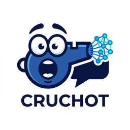
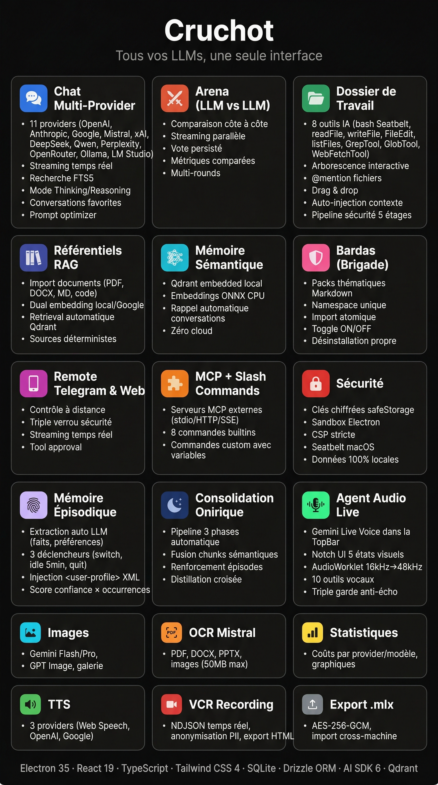
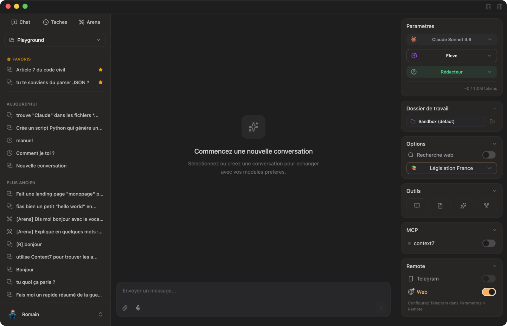
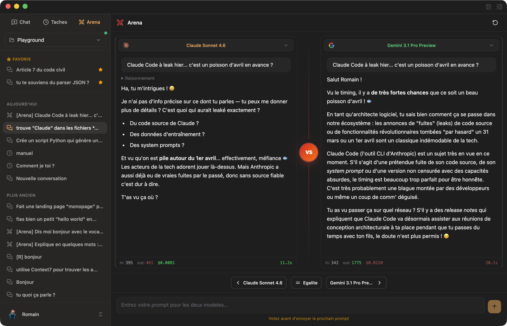
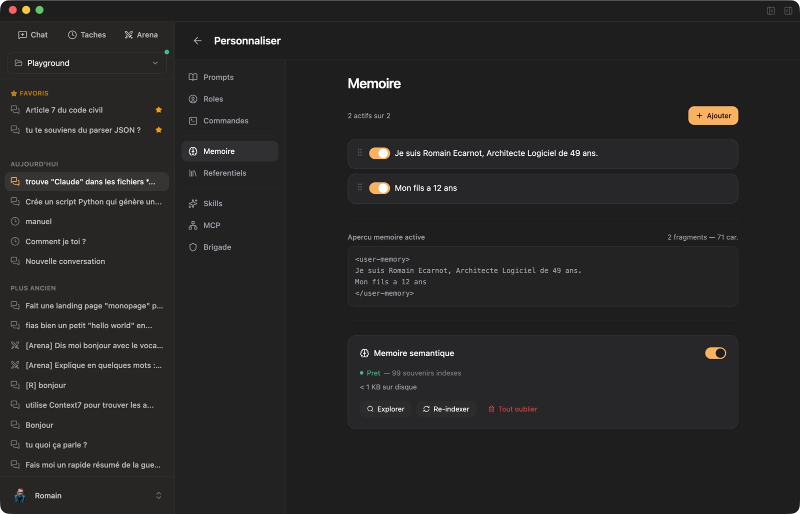
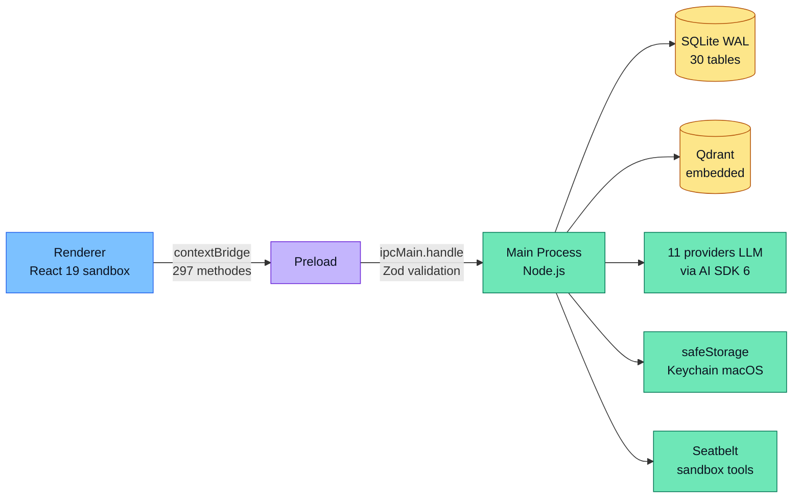

<p align="center">
  <picture>
    <source media="(prefers-color-scheme: dark)" srcset="resources/logo-cruchot-transparent.png" />
    <source media="(prefers-color-scheme: light)" srcset="resources/logo-cruchot.png" />
    
  </picture>
</p>

<p align="center">
  <strong>Cruchot</strong> — Le client desktop multi-LLM qui respecte ta vie privee.<br />
  <em>11 providers IA dans une seule app. 100% local. Open source.</em>
</p>

<p align="center">
  <a href="https://github.com/eRom/cruchot/releases/latest"></a>
  <a href="https://github.com/eRom/cruchot/actions/workflows/ci.yml"></a>
  <a href="./LICENSE"></a>
  
  
  
  <a href="https://cruchot.romain-ecarnot.com"></a>
</p>

<p align="center">
  <a href="https://cruchot.romain-ecarnot.com"><strong>Site web →</strong></a>
  ·
  <a href="https://github.com/eRom/cruchot/releases/latest"><strong>Telecharger pour macOS</strong></a>
  ·
  <a href="#fonctionnalites">Fonctionnalites</a>
  ·
  <a href="CHANGELOG.md">Changelog</a>
</p>

<p align="center">
  
</p>

---

## Table des matieres

- [Pourquoi Cruchot ?](#pourquoi-cruchot-)
- [Quick Start](#quick-start)
- [Stack](#stack)
- [Installation & Init](#installation--init)
- [Architecture](#architecture)
- [Fonctionnalites](#fonctionnalites)
- [Securite](#securite)
- [Distribution](#distribution)
- [Contribuer](#contribuer)
- [Licence](#licence)

## Pourquoi Cruchot ?

Les apps multi-LLM cloud (Poe, ChatHub, Msty) exposent tes conversations a des serveurs tiers. Les apps 100% locales (ChatBox, Jan.ai) sont limitees en fonctionnalites avancees. **Cruchot comble le trou** : toute la puissance d'un client pro, sans jamais quitter ta machine.

- **11 providers** (OpenAI, Anthropic, Google, Mistral, xAI, DeepSeek, Alibaba, Perplexity, OpenRouter, Ollama, LM Studio)
- **100% local** : SQLite + Qdrant embedded, cles API chiffrees via Keychain macOS, zero telemetrie
- **Security score 98/100** : sandbox renderer, Seatbelt macOS, pipeline permissions 5 etages, `@electron/fuses`
- **Fonctionnalites avancees uniques** : Arena (LLM vs LLM), memoire episodique auto-extraite, RAG custom Qdrant, Conversation Tools (8 outils LLM), Remote Telegram/Web, Live Voice, export `.mlx` chiffre AES-256-GCM

Pour la visite complete avec captures d'ecran et explications detaillees, rendez-vous sur **[cruchot.romain-ecarnot.com](https://cruchot.romain-ecarnot.com)**.

### Comparaison avec les alternatives

| Fonctionnalite | **Cruchot** | Msty | Jan.ai | ChatBox | LibreChat |
|---|---|---|---|---|---|
| 100% local (aucun serveur) | ✅ | ✅ | ✅ | ⚠️ partiel | ❌ serveur |
| Nombre de providers cloud | **11** | ~8 | ~4 | ~6 | ~10 |
| RAG custom (docs locaux) | ✅ Qdrant embedded | ⚠️ basique | ❌ | ❌ | ✅ |
| Conversation Tools (bash, file, web) | ✅ **8 tools + sandbox** | ❌ | ❌ | ❌ | ⚠️ limite |
| Memoire episodique auto | ✅ extraction LLM | ❌ | ❌ | ❌ | ❌ |
| Arena (LLM vs LLM side-by-side) | ✅ | ❌ | ❌ | ❌ | ❌ |
| Remote mobile (Telegram/Web) | ✅ | ❌ | ❌ | ❌ | ⚠️ web only |
| Export chiffre cross-machine | ✅ `.mlx` AES-256-GCM | ❌ | ❌ | ❌ | ❌ |
| Audit securite public | ✅ **98/100** | ❌ | ❌ | ❌ | ❌ |
| Open source | ✅ MIT | ❌ proprio | ✅ AGPL | ✅ | ✅ MIT |

Cruchot est la seule app qui combine **local-first strict** + **feature set pro** + **securite auditee**. Les chiffres par provider sont indicatifs (derniere verification : avril 2026).

### Apercu

<p align="center">
  <a href="https://cruchot.romain-ecarnot.com"></a>
</p>

<p align="center">
  <a href="https://cruchot.romain-ecarnot.com">&nbsp;</a>
</p>

<p align="center">
  <em>Plus de captures et demo complete sur <a href="https://cruchot.romain-ecarnot.com"><strong>cruchot.romain-ecarnot.com</strong></a></em>
</p>

## Quick Start

```bash
# Telecharger la derniere release macOS (DMG)
curl -L https://github.com/eRom/cruchot/releases/latest/download/Cruchot-arm64.dmg -o Cruchot.dmg && open Cruchot.dmg
```

Ou telecharge directement depuis la [**page Releases**](https://github.com/eRom/cruchot/releases/latest).

Au premier lancement, l'assistant de bienvenue te guide pour configurer tes cles API (chiffrees via `safeStorage`). Pour developper localement, voir [Installation & Init](#installation--init).

## Stack

| Couche | Technologies |
|--------|-------------|
| Runtime | Electron 41 + Node.js 24 |
| Frontend | React 19 + TypeScript 5.7 + Tailwind CSS 4 + shadcn/ui |
| LLM | Vercel AI SDK 6 (`ai@^6`) |
| Database | SQLite (better-sqlite3) + Drizzle ORM + Qdrant (embedded) |
| Embeddings | `@huggingface/transformers` (ONNX) + Google Gemini 2 |
| State | Zustand |
| Build | electron-vite + electron-builder |

## Installation & Init

### Pre-requis

- **Node.js** >= 22 (recommande : 24.x)
- **npm** >= 10
- **macOS** 13+ (builds Windows/Linux possibles mais non testes)
- **Qdrant** binaire local (telecharge automatiquement via script)

### Setup

```bash
# Cloner le repo
git clone https://github.com/eRom/cruchot.git
cd cruchot

# Installer les dependances
npm install --legacy-peer-deps

# Telecharger le binaire Qdrant (memoire semantique + RAG)
./scripts/download-qdrant.sh

# Preparer les modeles ONNX pour l'embedding local
./scripts/prepare-models.sh

# Lancer en mode dev (HMR)
npm run dev
```

### Commandes

```bash
npm run dev           # Dev avec HMR (renderer) + hot restart (main)
npm run build         # Build production
npm run typecheck     # Verification des types (tsc --noEmit)
npm run lint          # ESLint
npm run test          # Vitest
npm run dist:mac      # Package macOS (DMG + ZIP)
npm run dev:web       # Dev SPA Remote Web (standalone)
```

### Configuration des cles API

Au premier lancement, l'assistant de bienvenue guide la configuration. Les cles API sont chiffrees via `safeStorage` (Keychain macOS) et ne transitent jamais par le renderer.

Providers supportes : OpenAI, Anthropic, Google, Mistral, xAI, DeepSeek, Alibaba, Perplexity, OpenRouter. Providers locaux (sans cle) : Ollama, LM Studio.

## Architecture



Equivalent texte :

```
Renderer (React UI)  -->  contextBridge IPC  -->  Main (Node.js)
     sandbox              297 methodes               DB, APIs, secrets
```

L'app suit le modele de securite Electron strict : le renderer est sandbox, n'a aucun acces Node.js, et communique exclusivement via des methodes typees exposees par le preload.

```
src/
  main/           # Electron main process
    ipc/          #   Handlers IPC par domaine (Zod validation)
    llm/          #   Routeur AI SDK, cost-calculator, tools, prompts
    db/           #   Schema Drizzle (30 tables), queries
    services/     #   Singletons metier (library, qdrant, git, mcp, remote...)
  preload/        # Bridge IPC securise (contextBridge)
  renderer/src/   # React app
    components/   #   Composants par domaine
    stores/       #   Zustand stores
    hooks/        #   Custom hooks
  remote-web/     # SPA standalone pour Remote Web
```

## Fonctionnalites

### Chat Multi-Provider
- **11 providers** : OpenAI, Anthropic, Google, Mistral, xAI, DeepSeek, Alibaba, Perplexity, Ollama, LM Studio
- Streaming temps reel, historique illimite avec recherche full-text (FTS5)
- Mode Thinking/Reasoning (Anthropic, OpenAI, Google, xAI, DeepSeek)
- Annulation de stream en cours
- **Conversations favorites** : pin/star pour garder les conversations importantes en haut de la sidebar
- **Prompt Optimizer** : amelioration automatique du prompt via LLM avant envoi (one-shot)

### Arena (LLM vs LLM)
- Comparaison cote a cote de 2 modeles sur le meme prompt
- Streaming parallele des deux reponses simultanement
- Separateur VS anime (glow pulse pendant le streaming)
- Vote (gauche/droite/egalite) persiste en DB avec statistiques par modele
- Metriques comparees : tokens, cout, temps de reponse (coloration vert/rouge)
- Multi-rounds : continuer la conversation apres chaque vote
- Conversations arena identifiees dans la sidebar (icone Swords)

### Generation d'images
- 3 modeles : Gemini Flash, Gemini Pro, GPT Image
- Modèles d'OpenRouter spécifiques pour Image
- Selection d'aspect ratio, galerie avec apercu

### Workspace Co-Work
- Arborescence de fichiers interactive avec indicateurs Git (M/A/D/?)
- **8 outils IA** : bash, readFile, writeFile, FileEdit, listFiles, GrepTool, GlobTool, WebFetchTool
- **Pipeline securite 5 etages** : security checks → deny rules → readonly → allow rules → approval (ou YOLO) → execution
- **Seatbelt macOS** : confinement sandbox (allow default + deny cible), stdout/stderr fonctionnels
- **Mode YOLO** : bypass les prompts d'approbation (security checks hard restent actifs)
- **READONLY_COMMANDS** : ~60 commandes auto-allow sans approbation (ls, grep, cat, head, etc.)
- Detection de changements en temps reel (Chokidar)
- `@mention` de fichiers inline dans le textarea (autocomplete + overlay cyan)
- **Drag & drop de fichiers** depuis le Finder directement dans la zone de saisie (texte, code, documents)
- Auto-injection des fichiers de contexte (CLAUDE.md, README.md, etc.)

### Referentiels RAG Custom (Bibliothèques de connaissances)
- Import de documents (PDF, DOCX, Markdown, code, CSV, TXT) dans des referentiels thematiques
- Dual embedding : local (all-MiniLM-L6-v2, 384d) ou Google (gemini-embedding-2-preview, 768d)
- Retrieval automatique sticky par conversation (Qdrant, cosine similarity)
- Section "Sources utilisees" deterministe sous les reponses
- Vue CRUD complete avec progress bar d'indexation

### Memoire Semantique
- Rappel automatique des conversations passees via recherche vectorielle locale
- Qdrant embedded (binaire Rust local), embeddings ONNX CPU
- Ingestion fire-and-forget, recall silencieux dans le system prompt
- Zero cloud — tout tourne en local

### MCP (Model Context Protocol)
- Connexion a des serveurs MCP externes (stdio, HTTP, SSE)
- Variables d'environnement chiffrees, scope par projet
- Outils MCP fusionnes avec les workspace tools dans le chat

### Remote access
- Telegram
  - Controle a distance depuis un smartphone via Telegram Bot API
  - Triple verrou : token chiffre + code pairing 6 chiffres + ID Telegram verifie
  - Streaming en temps reel, tool approval via inline keyboards
  - Zero serveur backend, long polling HTTPS sortant
- Web
  - SPA standalone (React + Tailwind), WebSocket sur localhost
  - Pairing par code 6 chiffres + QR code
  - Calque visuel exact du desktop

### Slash Commands
- 8 commandes builtins (`/resume`, `/explain`, `/refactor`, `/debug`, `/translate`, `/commit-msg`, `/review`, `/test`)
- Commandes personnalisees avec variables (`$ARGS`, `$MODEL`, `$PROJECT`, etc.)
- Autocomplete dans la zone de saisie, scope par projet

### Recherche Web (Perplexity)
- Mode Search activable dans la zone de saisie
- Le LLM decide quand chercher sur le web (tool call)
- Sources numerotees cliquables sous la reponse

### Export/Import securise (.mlx)
- Export chiffre AES-256-GCM de toutes les conversations et projets
- Token d'instance 32 bytes (safeStorage), import cross-machine
- Import transactionnel SQLite avec deduplication

### Bardas (Gestion de Brigade)
- Packs thematiques au format Markdown (.md) contenant roles, commandes, prompts, fragments memoire, referentiels et serveurs MCP
- Import en un clic avec preview du contenu et rapport detaille (succes, skips MCP, warnings)
- Namespace unique par barda — les ressources importees ne collisionnent jamais avec les ressources custom
- Toggle ON/OFF global : desactive toutes les ressources d'un barda sans les supprimer
- Desinstallation propre : suppression atomique de toutes les ressources du namespace
- 3 bardas exemples inclus (ecrivain, dev-react, philosophe) dans `examples/`
- Format ouvert : editable dans n'importe quel editeur texte, versionnable dans Git

### Skills
- Packs autonomes au format Markdown + frontmatter YAML (compatible Claude Code)
- Installation depuis URL GitHub (monorepo supporte), dossier local, ou section `## Skills` dans un Barda
- Scan de securite Maton : scanner Python (107 regles, 18 categories) + analyse contextuelle LLM via modele par defaut
- Toggle Maton ON/OFF a l'installation, verdicts Scanner + Contextuel avec findings detailles
- Invocation via `/skill-name args` dans les conversations (merge dans le dropdown autocomplete)
- Injection `<skill-context>` dans le system prompt, execution de blocs shell `!cmd` via Seatbelt
- Vue complete dans Personnaliser > Skills : grille, detail (tree filtre, preview, metadata), toggle ON/OFF, desinstallation
- Sync bidirectionnelle filesystem ↔ DB au demarrage

### Autres fonctionnalites
- **Projets** : organisation avec modele par defaut, workspace lie, system prompt
- **Roles** : builtin et custom, variables dynamiques `{{varName}}`
- **Prompts** : bibliotheque reutilisable (complet, complement, system)
- **Taches planifiees** : execution LLM automatique (intervalle, quotidien, hebdomadaire)
- **TTS** : 3 providers (navigateur, OpenAI, Google)
- **Statistiques** : suivi des couts par provider/modele/projet, graphiques
- **Memory Fragments** : contexte personnel persistant, drag & drop
- **Palette de commandes** : Cmd+K recherche globale

## Securite

L'architecture de securite repose sur l'isolation stricte des 3 couches Electron :

### Renderer (sandbox)
- `nodeIntegration: false`, `contextIsolation: true`, `sandbox: true`
- CSP stricte (`script-src 'self'`, `connect-src 'self' https://*.openai.com ...`)
- DOMPurify sur le HTML Shiki et Mermaid
- Liens Markdown : whitelist de schemas (https, http, mailto, #)

### Preload (bridge)
- 297 methodes typees via `contextBridge`, jamais `ipcRenderer` directement
- Cleanup des listeners via `removeAllListeners`

### Main (Node.js)
- **Cles API** : chiffrees via `safeStorage` (Keychain macOS), jamais exposees au renderer
- **IPC** : validation Zod sur tous les handlers, settings proteges par whitelist (`ALLOWED_SETTING_KEYS`)
- **Bash tool** : 22 security checks hard, Seatbelt macOS (allow default + deny file-write cible), env minimal (PATH restreint), READONLY_COMMANDS auto-allow, timeout 30s
- **Fichiers** : `isPathAllowed()` (confinement userData + workspace), `SENSITIVE_PATTERNS`, extension blocklist, `fs.realpathSync()` anti-symlink
- **Git** : env immutable `GIT_BASE_ENV` (Readonly), `GIT_CONFIG_NOSYSTEM=1`, `validateGitPaths()` sur toutes les operations
- **MCP** : env minimal stdio (PATH/HOME/TMPDIR/LANG/SHELL/USER), env vars chiffrees
- **Remote** : `crypto.timingSafeEqual` sur le pairing, `maxPayload 64KB` (WebSocket), broadcast reserve aux clients authentifies
- **Skills** : `realpathSync()` sur les chemins, regex validation des noms (`[a-zA-Z0-9_\-.:]+`), `JSON.stringify()` anti-injection dans les commandes Python, recherche SKILL.md confinee (3 niveaux max), cleanup temp dirs (`/tmp/cruchot-skill-*`), Maton scan avant installation
- **FTS5** : `sanitizeFtsQuery()` neutralise les operateurs MATCH, resultats tronques a 500 chars
- **XML injection** : contenu sanitise avant injection dans le system prompt (workspace, fichiers, library-context, semantic-memory)
- **Factory reset** : double confirmation (renderer + dialog natif main)
- **Export .mlx** : AES-256-GCM, IV unique par export, token hors whitelist renderer

### Donnees
- SQLite WAL + 30 tables Drizzle, donnees 100% locales
- Qdrant vector DB embedded (127.0.0.1 uniquement)
- Zero telemetrie, zero serveur backend

## Distribution

```bash
npm run dist:mac      # DMG + ZIP (universal)
npm run dist:win      # NSIS installer
npm run dist:linux    # AppImage + deb
```

Auto-updater integre via `electron-updater` (GitHub Releases).

## Contribuer

Les contributions sont les bienvenues ! Pour demarrer :

- **Guide de contribution** : voir [CONTRIBUTING.md](CONTRIBUTING.md) (workflow, standards, tests, conventions de commit)
- **Code de conduite** : voir [CODE_OF_CONDUCT.md](CODE_OF_CONDUCT.md) (Contributor Covenant 2.1)
- **Politique de securite** : voir [SECURITY.md](SECURITY.md) pour signaler une vulnerabilite (ne pas ouvrir d'issue publique)
- **Good First Issues** : [parcours tes premieres contributions](https://github.com/eRom/cruchot/issues?q=is%3Aopen+is%3Aissue+label%3A%22good+first+issue%22)
- **Changelog** : voir [CHANGELOG.md](CHANGELOG.md) pour l'historique des versions

## Licence

[MIT](LICENSE) © [Romain Ecarnot](https://www.romain-ecarnot.com)
