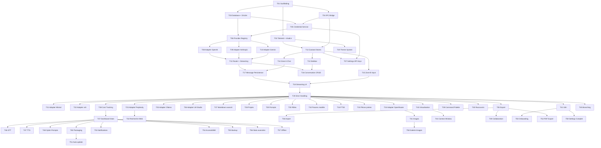

# Tasks : Multi-LLM Desktop

**Date** : 2026-03-09
**Contexte** : [PLAN.md](./PLAN.md) — 60 tâches, 3 phases, 3 pistes

---

## P0 — MVP Core

---

### T01 · Scaffolding projet

**But** : Initialiser le projet Electron + React + TypeScript avec electron-vite.

**Fichiers concernés** :
- `[NEW]` `package.json`
- `[NEW]` `electron.vite.config.ts`
- `[NEW]` `tsconfig.json`
- `[NEW]` `tsconfig.node.json`
- `[NEW]` `tsconfig.web.json`
- `[NEW]` `src/main/index.ts`
- `[NEW]` `src/main/window.ts`
- `[NEW]` `src/preload/index.ts`
- `[NEW]` `src/renderer/index.html`
- `[NEW]` `src/renderer/src/main.tsx`
- `[NEW]` `src/renderer/src/App.tsx`
- `[NEW]` `src/renderer/env.d.ts`

**Piste** : infra

**Dépendances** : aucune

**MCP** : Context7 `electron-vite` — template React + TS, config par défaut

**Critères d'acceptation** :
- [ ] `npm run dev` démarre l'app Electron avec HMR
- [ ] Le renderer affiche "Hello World" dans une fenêtre
- [ ] Le main process log "App ready" dans la console
- [ ] TypeScript compile sans erreur pour les 3 cibles (main, preload, renderer)
- [ ] La structure src/main, src/preload, src/renderer est en place

---

### T02 · Tailwind CSS + shadcn/ui

**But** : Configurer Tailwind CSS 4 et initialiser shadcn/ui avec les composants de base.

**Fichiers concernés** :
- `[NEW]` `tailwind.config.ts`
- `[NEW]` `src/renderer/src/styles/globals.css`
- `[NEW]` `src/renderer/src/components/ui/button.tsx`
- `[NEW]` `src/renderer/src/components/ui/input.tsx`
- `[NEW]` `src/renderer/src/components/ui/dialog.tsx`
- `[NEW]` `src/renderer/src/components/ui/dropdown-menu.tsx`
- `[NEW]` `src/renderer/src/components/ui/select.tsx`
- `[NEW]` `src/renderer/src/components/ui/tooltip.tsx`
- `[NEW]` `src/renderer/src/components/ui/scroll-area.tsx`
- `[NEW]` `src/renderer/src/lib/utils.ts`
- `[MODIFY]` `electron.vite.config.ts`

**Piste** : frontend

**Dépendances** : T01

**MCP** : Context7 `shadcn-ui` — init CLI, composants de base

**Critères d'acceptation** :
- [ ] Tailwind fonctionne avec les CSS variables (--primary, --background, etc.)
- [ ] Les composants shadcn/ui sont installés et rendus correctement
- [ ] La classe `dark` sur `<html>` active le thème sombre
- [ ] `cn()` utility est disponible pour combiner les classes

---

### T03 · Database + Drizzle ORM

**But** : Créer le schéma complet de la base SQLite avec Drizzle ORM et configurer les pragmas.

**Fichiers concernés** :
- `[NEW]` `src/main/db/index.ts`
- `[NEW]` `src/main/db/schema.ts`
- `[NEW]` `src/main/db/relations.ts`
- `[NEW]` `src/main/db/migrate.ts`
- `[NEW]` `drizzle.config.ts`
- `[NEW]` `src/main/utils/paths.ts`
- `[MODIFY]` `package.json` (scripts db:generate, db:migrate)

**Piste** : backend

**Dépendances** : T01

**MCP** : Context7 `drizzle-orm` — schema SQLite, better-sqlite3 driver, pragmas

**Critères d'acceptation** :
- [ ] Les 11 tables sont définies dans schema.ts (providers, models, projects, conversations, messages, attachments, prompts, roles, settings, statistics, images)
- [ ] Les relations Drizzle sont correctement définies
- [ ] WAL mode est activé au démarrage (`PRAGMA journal_mode = WAL`)
- [ ] `PRAGMA foreign_keys = ON` est activé
- [ ] `npm run db:generate` génère les fichiers de migration
- [ ] `npm run db:migrate` applique les migrations
- [ ] La DB est créée dans `~/Library/Application Support/MultiLLM/db/main.db`
- [ ] Les enums/constantes (MessageRole, ProviderType, ModelCategory, etc.) sont exportés

---

### T04 · IPC Bridge

**But** : Implémenter le preload script avec contextBridge et les types partagés pour la communication sécurisée main/renderer.

**Fichiers concernés** :
- `[MODIFY]` `src/preload/index.ts`
- `[NEW]` `src/preload/types.ts`
- `[NEW]` `src/main/ipc/index.ts`
- `[NEW]` `src/renderer/src/lib/ipc.ts`
- `[MODIFY]` `src/renderer/env.d.ts`

**Piste** : fullstack

**Dépendances** : T01

**Critères d'acceptation** :
- [ ] `window.api` est exposé dans le renderer via contextBridge
- [ ] Les méthodes invoke (request/response) fonctionnent
- [ ] Les événements streaming (on/off) fonctionnent
- [ ] Les types TypeScript sont partagés entre main et renderer
- [ ] `contextIsolation: true` et `nodeIntegration: false` dans les webPreferences
- [ ] Le renderer n'a aucun accès direct à Node.js ou Electron

---

### T05 · Credential Service

**But** : Implémenter le stockage sécurisé des clés API via Electron safeStorage (Keychain macOS).

**Fichiers concernés** :
- `[NEW]` `src/main/services/credential.service.ts`
- `[NEW]` `src/main/ipc/providers.ipc.ts`

**Piste** : backend

**Dépendances** : T03, T04

**Critères d'acceptation** :
- [ ] Les clés API sont chiffrées avec safeStorage.encryptString()
- [ ] Les clés sont stockées en DB (colonne api_key_ref) sous forme chiffrée
- [ ] La récupération via safeStorage.decryptString() fonctionne
- [ ] Les clés ne sont jamais envoyées au renderer (seul le statut valid/invalid)
- [ ] Le masquage des clés est appliqué (sk-*****)

---

### T06 · Provider Registry

**But** : Créer le registre des providers avec leurs métadonnées et la liste statique des modèles.

**Fichiers concernés** :
- `[NEW]` `src/main/llm/types.ts`
- `[NEW]` `src/main/llm/registry.ts`
- `[NEW]` `src/main/db/queries/providers.ts`
- `[MODIFY]` `src/main/ipc/providers.ipc.ts`

**Piste** : backend

**Dépendances** : T03, T05

**Critères d'acceptation** :
- [ ] Les 9 providers sont définis avec leurs métadonnées (nom, logo, endpoint, capabilities)
- [ ] La liste statique des modèles principaux est définie par provider avec pricing
- [ ] Le type `LLMAdapter` interface est défini (streamChat, listModels, validateKey)
- [ ] Le type `StreamChunk` union est défini (content, thinking, usage, error, done)
- [ ] Les providers sont persistés en DB avec leur statut (actif/inactif)
- [ ] L'IPC `providers:list` retourne la liste des providers avec statut de clé

---

### T07 · Settings UI — API Keys

**But** : Créer l'écran de configuration des clés API par provider avec validation en temps réel.

**Fichiers concernés** :
- `[NEW]` `src/renderer/src/components/settings/SettingsView.tsx`
- `[NEW]` `src/renderer/src/components/settings/ApiKeysSettings.tsx`
- `[NEW]` `src/renderer/src/components/settings/ProviderCard.tsx`
- `[MODIFY]` `src/renderer/src/stores/providers.store.ts`

**Piste** : frontend

**Dépendances** : T05, T12

**MCP** : Context7 `shadcn-ui` — Input, Button, Card patterns

**Critères d'acceptation** :
- [ ] Chaque provider a une carte avec champ de saisie de clé masquée
- [ ] Le bouton "Valider" appelle l'endpoint test du provider
- [ ] L'indicateur visuel affiche valid/invalid/loading
- [ ] Les clés sont sauvegardées via IPC dans le credential service
- [ ] La navigation vers Settings fonctionne depuis la sidebar

---

### T08 · AI SDK Setup + Providers principaux

**But** : Installer et configurer le Vercel AI SDK avec les 3 providers principaux (OpenAI, Anthropic, Gemini).

**Fichiers concernés** :
- `[NEW]` `src/main/llm/router.ts`
- `[NEW]` `src/main/llm/providers.ts`
- `[NEW]` `src/main/llm/cost-calculator.ts`
- `[MOD]` `package.json`

**Piste** : llm

**Dépendances** : T06

**MCP** : Context7 `ai` (Vercel AI SDK) — streamText, providers, onChunk, onFinish

**Critères d'acceptation** :
- [ ] `ai`, `@ai-sdk/openai`, `@ai-sdk/anthropic`, `@ai-sdk/google` installés
- [ ] `router.ts` exporte `getModel(provider, modelId)` qui retourne un `LanguageModel`
- [ ] `providers.ts` configure chaque provider avec la clé depuis safeStorage
- [ ] `cost-calculator.ts` exporte `calculateCost(modelId, usage)` avec table PRICING vide (à remplir)
- [ ] Les 3 providers principaux sont routables
- [ ] TypeScript compile sans erreur

---

### T09 · LLM Router + Streaming IPC

**But** : Implémenter le routage LLM complet avec streaming via IPC et support des features provider-specific.

**Fichiers concernés** :
- `[MOD]` `src/main/llm/router.ts`
- `[MOD]` `src/main/ipc/chat.ipc.ts`
- `[MOD]` `src/preload/index.ts`

**Piste** : llm

**Dépendances** : T08

**MCP** : Context7 `ai` — streamText, onChunk, abortSignal, providerOptions

**Critères d'acceptation** :
- [ ] `chat:send` IPC handler utilise `streamText()` du AI SDK
- [ ] Les chunks sont forwardés via `webContents.send('chat:chunk', chunk)` via le callback `onChunk`
- [ ] `onFinish` sauvegarde usage + calcule le coût via `cost-calculator.ts`
- [ ] `abortSignal` est câblé pour l'annulation via `chat:cancel`
- [ ] Extended Thinking Anthropic fonctionne via `providerOptions`
- [ ] Les erreurs sont classifiées (transient/fatal/actionable)

---

### T10 · Image Generation (Gemini)

**But** : Implémenter la génération d'images via le AI SDK avec les 2 modèles Gemini.

**Fichiers concernés** :
- `[NEW]` `src/main/llm/image.ts`
- `[NEW]` `src/main/ipc/images.ipc.ts`
- `[MOD]` `src/main/ipc/index.ts`
- `[MOD]` `src/preload/index.ts`

**Piste** : llm

**Dépendances** : T08

**MCP** : Context7 `@ai-sdk/google` — generateImage, google.image()

**Critères d'acceptation** :
- [ ] `image.ts` exporte `generateImage()` wrapper avec choix du modèle
- [ ] 2 modèles disponibles : `gemini-3.1-flash-image-preview` et `gemini-3-pro-image-preview`
- [ ] IPC `images:generate` handler fonctionnel
- [ ] L'image générée est sauvegardée sur le filesystem
- [ ] Les paramètres (aspect ratio, taille) sont configurables
- [ ] TypeScript compile sans erreur

---

### T11 · Providers supplémentaires (Mistral, xAI, Perplexity)

**But** : Ajouter les providers supplémentaires au routeur AI SDK.

**Fichiers concernés** :
- `[MOD]` `src/main/llm/router.ts`
- `[MOD]` `src/main/llm/providers.ts`
- `[MOD]` `package.json`

**Piste** : llm

**Dépendances** : T09

**MCP** : Context7 `ai` — @ai-sdk/mistral, @ai-sdk/xai, createOpenAICompatible

**Critères d'acceptation** :
- [ ] `@ai-sdk/mistral`, `@ai-sdk/xai` installés
- [ ] `createOpenAICompatible()` configuré pour Perplexity
- [ ] Les 3 providers sont routables via `getModel()`
- [ ] Streaming fonctionne pour les 3 providers
- [ ] TypeScript compile sans erreur

---

### T12 · Zustand Stores

**But** : Créer les stores Zustand avec le pattern slices pour l'état de l'application.

**Fichiers concernés** :
- `[NEW]` `src/renderer/src/stores/conversations.store.ts`
- `[NEW]` `src/renderer/src/stores/messages.store.ts`
- `[NEW]` `src/renderer/src/stores/providers.store.ts`
- `[NEW]` `src/renderer/src/stores/settings.store.ts`
- `[NEW]` `src/renderer/src/stores/ui.store.ts`

**Piste** : frontend

**Dépendances** : T02, T04

**MCP** : Context7 `zustand` — slices, persist, subscribeWithSelector

**Critères d'acceptation** :
- [ ] Le store `conversations` gère la liste et la sélection active
- [ ] Le store `messages` gère les messages de la conversation active + buffer streaming
- [ ] Le store `providers` gère la liste des providers et modèles
- [ ] Le store `settings` persiste dans electron-store (thème, langue, etc.)
- [ ] Le store `ui` gère la vue active, sidebar, modals, loading
- [ ] Chaque store est un slice composable
- [ ] Le middleware `persist` est utilisé uniquement pour settings

---

### T13 · Sidebar

**But** : Créer la sidebar avec la liste des conversations, le bouton nouvelle conversation et la navigation.

**Fichiers concernés** :
- `[NEW]` `src/renderer/src/components/layout/Sidebar.tsx`
- `[NEW]` `src/renderer/src/components/layout/AppLayout.tsx`
- `[NEW]` `src/renderer/src/components/conversations/ConversationList.tsx`
- `[NEW]` `src/renderer/src/components/conversations/ConversationItem.tsx`

**Piste** : frontend

**Dépendances** : T12

**Critères d'acceptation** :
- [ ] La sidebar affiche la liste des conversations triées par date
- [ ] Le bouton "Nouvelle conversation" crée une conversation
- [ ] Cliquer sur une conversation la sélectionne et affiche ses messages
- [ ] La conversation active est visuellement distincte
- [ ] La sidebar est rétractable
- [ ] Les liens de navigation (Settings, Stats) sont présents
- [ ] Le titre de chaque conversation est affiché (tronqué si long)

---

### T14 · Zone A — Chat Display

**But** : Créer la zone d'affichage des messages avec rendu Markdown basique et scroll auto.

**Fichiers concernés** :
- `[NEW]` `src/renderer/src/components/chat/ChatView.tsx`
- `[NEW]` `src/renderer/src/components/chat/MessageList.tsx`
- `[NEW]` `src/renderer/src/components/chat/MessageItem.tsx`
- `[NEW]` `src/renderer/src/components/chat/MessageContent.tsx`
- `[NEW]` `src/renderer/src/components/chat/MarkdownRenderer.tsx`
- `[NEW]` `src/renderer/src/lib/markdown.ts`

**Piste** : frontend

**Dépendances** : T12

**MCP** : Context7 `react-markdown` — plugins rehype/remark basiques

**Critères d'acceptation** :
- [ ] Les messages user et assistant sont affichés avec distinction visuelle
- [ ] Le badge du provider/modèle est affiché sur chaque message
- [ ] Le Markdown basique est rendu (gras, italique, listes, code inline, blocs de code)
- [ ] Les blocs de code ont une coloration syntaxique minimale
- [ ] Le scroll auto fonctionne pendant le streaming
- [ ] Le bouton "scroll to bottom" apparaît quand on remonte
- [ ] Les tokens/coût/temps sont affichés par message
- [ ] Le bouton copier fonctionne sur les messages et blocs de code

---

### T15 · Zone B — Input

**But** : Créer la zone de saisie avec textarea extensible, sélecteur de modèle et envoi.

**Fichiers concernés** :
- `[NEW]` `src/renderer/src/components/chat/InputZone.tsx`
- `[NEW]` `src/renderer/src/components/chat/ModelSelector.tsx`

**Piste** : frontend

**Dépendances** : T12

**Critères d'acceptation** :
- [ ] Le textarea est auto-grow (s'agrandit avec le contenu)
- [ ] Enter envoie, Shift+Enter fait un saut de ligne
- [ ] Le sélecteur de modèle affiche les modèles groupés par provider
- [ ] Le modèle sélectionné est affiché dans le dropdown
- [ ] Le bouton Envoyer est désactivé si le textarea est vide
- [ ] Le placeholder change selon le modèle sélectionné

---

### T16 · Conversation CRUD

**But** : Implémenter le CRUD complet des conversations (IPC + DB + UI).

**Fichiers concernés** :
- `[NEW]` `src/main/db/queries/conversations.ts`
- `[NEW]` `src/main/ipc/conversations.ipc.ts`
- `[MODIFY]` `src/main/ipc/index.ts`
- `[MODIFY]` `src/renderer/src/stores/conversations.store.ts`
- `[MODIFY]` `src/renderer/src/components/conversations/ConversationItem.tsx`

**Piste** : fullstack

**Dépendances** : T11, T13

**Critères d'acceptation** :
- [ ] Créer une conversation (avec modèle initial)
- [ ] Le titre est auto-généré à partir du premier message (appel LLM court)
- [ ] Renommer une conversation (double-clic ou menu contextuel)
- [ ] Supprimer une conversation (avec confirmation)
- [ ] La liste se rafraîchit après chaque opération
- [ ] La conversation est sélectionnée après création

---

### T17 · Message Persistence

**But** : Persister les messages en DB et les recharger au changement de conversation.

**Fichiers concernés** :
- `[NEW]` `src/main/db/queries/messages.ts`
- `[MODIFY]` `src/main/ipc/chat.ipc.ts`
- `[MODIFY]` `src/renderer/src/stores/messages.store.ts`

**Piste** : fullstack

**Dépendances** : T11, T14

**Critères d'acceptation** :
- [ ] Le message user est sauvé en DB avant l'envoi au LLM
- [ ] Le message assistant est sauvé en DB après `done` (contenu complet)
- [ ] Les tokens (in/out/cache), coût et temps de réponse sont persistés
- [ ] Le changement de conversation charge les messages depuis la DB
- [ ] Les messages s'affichent dans l'ordre chronologique
- [ ] Au redémarrage de l'app, les conversations et messages sont restaurés

---

### T18 · Streaming UI

**But** : Afficher les tokens en temps réel, l'indicateur de typing et le bouton Stop.

**Fichiers concernés** :
- `[NEW]` `src/renderer/src/components/chat/StreamingIndicator.tsx`
- `[NEW]` `src/renderer/src/hooks/useStreaming.ts`
- `[MODIFY]` `src/renderer/src/components/chat/MessageItem.tsx`
- `[MODIFY]` `src/renderer/src/components/chat/InputZone.tsx`

**Piste** : frontend

**Dépendances** : T17, T15

**Critères d'acceptation** :
- [ ] Les tokens s'affichent un par un dans un message "en construction"
- [ ] Un indicateur de typing (animation) est visible pendant le streaming
- [ ] Le bouton Stop remplace le bouton Envoyer pendant le streaming
- [ ] Cliquer sur Stop appelle `chat:cancel` et affiche le contenu partiel
- [ ] Le textarea est désactivé pendant le streaming
- [ ] Les compteurs (tokens, coût, temps) se mettent à jour en temps réel

---

### T19 · Theme System

**But** : Implémenter le système de thèmes (dark/light/system) avec basculement instantané.

**Fichiers concernés** :
- `[NEW]` `src/renderer/src/components/common/ThemeProvider.tsx`
- `[MODIFY]` `src/renderer/src/styles/globals.css`
- `[MODIFY]` `src/renderer/src/stores/settings.store.ts`
- `[MODIFY]` `src/renderer/src/App.tsx`

**Piste** : frontend

**Dépendances** : T02

**Critères d'acceptation** :
- [ ] Le thème dark/light/system fonctionne sans rechargement
- [ ] Les CSS variables changent instantanément
- [ ] Le choix est persisté dans le store settings
- [ ] Le mode "system" suit la préférence macOS
- [ ] Le toggle est accessible dans les settings et/ou la sidebar

---

### T20 · Error Handling

**But** : Implémenter la classification des erreurs API et l'affichage avec Sonner.

**Fichiers concernés** :
- `[MODIFY]` `src/main/llm/errors.ts`
- `[MODIFY]` `src/main/ipc/chat.ipc.ts`
- `[NEW]` `src/renderer/src/components/common/ErrorBoundary.tsx`
- `[MODIFY]` `src/renderer/src/hooks/useStreaming.ts`

**Piste** : fullstack

**Dépendances** : T18

**Critères d'acceptation** :
- [ ] Les erreurs transitoires (429, 500, 503) déclenchent un retry (max 3, backoff)
- [ ] Les erreurs fatales (401, 403) affichent un toast avec suggestion
- [ ] Les erreurs actionnables (402) affichent un toast avec lien d'action
- [ ] L'erreur est affichée comme message dans le chat si le retry échoue
- [ ] Un ErrorBoundary capture les erreurs React non gérées
- [ ] Les erreurs réseau sont détectées et affichées clairement

---

## P1 — Features

---

### T21 · OpenRouter integration

**But** : Intégrer OpenRouter via AI SDK avec ses features spécifiques (model listing, credits, auto-routing).

**Fichiers concernés** :
- `[MOD]` `src/main/llm/router.ts`
- `[MOD]` `src/main/llm/providers.ts`
- `[NEW]` `src/main/services/openrouter.service.ts`
- `[MOD]` `package.json`

**Piste** : llm

**Dépendances** : T20

**MCP** : Context7 `ai` — @ai-sdk/openrouter

**Critères d'acceptation** :
- [ ] `@ai-sdk/openrouter` installé et configuré dans le routeur
- [ ] Listing dynamique des modèles via GET /api/v1/models
- [ ] Suivi du solde de crédits via GET /api/v1/key
- [ ] Auto-routing avec model `openrouter/auto`
- [ ] Headers HTTP-Referer et X-OpenRouter-Title configurés
- [ ] Streaming fonctionne via AI SDK

---

### T22 · Providers locaux (Ollama + LM Studio)

**But** : Intégrer les providers locaux via AI SDK community provider (Ollama) et createOpenAICompatible (LM Studio).

**Fichiers concernés** :
- `[MOD]` `src/main/llm/router.ts`
- `[MOD]` `src/main/llm/providers.ts`
- `[NEW]` `src/main/services/local-providers.service.ts`

**Piste** : llm

**Dépendances** : T20

**Critères d'acceptation** :
- [ ] Ollama : détection automatique (port 11434), listing modèles locaux
- [ ] LM Studio : endpoint configurable, listing modèles chargés
- [ ] createOpenAICompatible() configuré pour LM Studio
- [ ] Indicateur visuel "local" vs "cloud"
- [ ] Fonctionnement hors-ligne pour les modèles locaux
- [ ] Coût = 0$ dans les statistiques

---

### T23 · ~~Adapter Perplexity~~ → Intégré dans T11

**Statut** : Fusionné dans T11 (Providers supplémentaires). Perplexity via `createOpenAICompatible()` du AI SDK.

---

### T24 · ~~Adapter OpenRouter~~ → Intégré dans T21

**Statut** : Fusionné dans T21 (OpenRouter integration via `@ai-sdk/openrouter`).

---

### T25 · ~~Adapter Ollama~~ → Intégré dans T22

**Statut** : Fusionné dans T22 (Providers locaux via AI SDK community provider).

---

### T26 · ~~Adapter LM Studio~~ → Intégré dans T22

**Statut** : Fusionné dans T22 (Providers locaux via `createOpenAICompatible()`).

---

### T27 · Markdown avancé

**But** : Intégrer Shiki (coloration syntaxique), KaTeX (LaTeX), Mermaid (diagrammes) et GFM (tables).

**Fichiers concernés** :
- `[MODIFY]` `src/renderer/src/components/chat/MarkdownRenderer.tsx`
- `[NEW]` `src/renderer/src/components/chat/CodeBlock.tsx`
- `[NEW]` `src/renderer/src/components/chat/MermaidBlock.tsx`
- `[MODIFY]` `src/renderer/src/lib/markdown.ts`

**Piste** : frontend

**Dépendances** : T20

**MCP** : Context7 `shiki` — highlighter config, thèmes

**Critères d'acceptation** :
- [ ] Les blocs de code ont une coloration Shiki avec indicateur de langage
- [ ] Le bouton "Copier le code" fonctionne sur chaque bloc
- [ ] Les formules LaTeX inline ($...$) et block ($$...$$) sont rendues par KaTeX
- [ ] Les blocs Mermaid sont rendus en diagrammes SVG inline
- [ ] Les tableaux GFM sont rendus correctement
- [ ] Les performances restent acceptables (pas de freeze sur les gros blocs)

---

### T28 · Projets

**But** : Implémenter le CRUD projets avec contexte projet (prompt système, modèle par défaut).

**Fichiers concernés** :
- `[NEW]` `src/main/db/queries/projects.ts`
- `[NEW]` `src/main/ipc/projects.ipc.ts`
- `[NEW]` `src/renderer/src/stores/projects.store.ts`
- `[NEW]` `src/renderer/src/components/projects/ProjectList.tsx`
- `[NEW]` `src/renderer/src/components/projects/ProjectForm.tsx`
- `[MODIFY]` `src/renderer/src/components/layout/Sidebar.tsx`
- `[MODIFY]` `src/main/ipc/index.ts`

**Piste** : fullstack

**Dépendances** : T20

**Critères d'acceptation** :
- [ ] Créer/modifier/supprimer un projet (nom, description, icône, couleur)
- [ ] Assigner une conversation à un projet
- [ ] Filtrer les conversations par projet dans la sidebar
- [ ] Le prompt système du projet est appliqué aux nouvelles conversations
- [ ] Le modèle par défaut du projet est pré-sélectionné

---

### T29 · Bibliothèque de prompts

**But** : Implémenter la bibliothèque de prompts avec CRUD, catégories, variables et insertion rapide.

**Fichiers concernés** :
- `[NEW]` `src/main/db/queries/prompts.ts`
- `[NEW]` `src/main/ipc/prompts.ipc.ts`
- `[NEW]` `src/renderer/src/stores/prompts.store.ts`
- `[NEW]` `src/renderer/src/components/prompts/PromptsView.tsx`
- `[NEW]` `src/renderer/src/components/prompts/PromptForm.tsx`
- `[NEW]` `src/renderer/src/components/prompts/PromptPicker.tsx`
- `[MODIFY]` `src/renderer/src/components/chat/InputZone.tsx`
- `[MODIFY]` `src/main/ipc/index.ts`

**Piste** : fullstack

**Dépendances** : T20

**Critères d'acceptation** :
- [ ] CRUD complet (créer, modifier, supprimer, dupliquer)
- [ ] Catégories personnalisables et tags libres
- [ ] Prompts avec variables ({{nom}}) et formulaire de saisie
- [ ] Types : complet, complément (préfixe/suffixe), système
- [ ] Insertion rapide depuis la Zone B (bouton ou `/`)
- [ ] Recherche dans la bibliothèque (titre + contenu)
- [ ] Compteur d'utilisation

---

### T30 · Rôles / Personas

**But** : Implémenter les rôles avec CRUD, prédéfinis et application aux conversations.

**Fichiers concernés** :
- `[NEW]` `src/main/db/queries/roles.ts`
- `[NEW]` `src/main/ipc/roles.ipc.ts`
- `[NEW]` `src/renderer/src/stores/roles.store.ts`
- `[NEW]` `src/renderer/src/components/roles/RolesView.tsx`
- `[NEW]` `src/renderer/src/components/roles/RoleForm.tsx`
- `[NEW]` `src/renderer/src/components/roles/RolePicker.tsx`
- `[MODIFY]` `src/main/ipc/index.ts`

**Piste** : fullstack

**Dépendances** : T20

**Critères d'acceptation** :
- [ ] CRUD complet (créer, modifier, supprimer, dupliquer)
- [ ] Rôles prédéfinis (Développeur, Rédacteur, Analyste, Traducteur, Coach)
- [ ] Le prompt système du rôle est injecté dans les conversations
- [ ] Sélection du rôle au démarrage ou en cours de conversation
- [ ] Indicateur visuel du rôle actif
- [ ] Catégories de rôles

---

### T31 · Génération d'images — UI

**But** : Implémenter l'interface de génération d'images Gemini (2 modèles via AI SDK generateImage) avec affichage inline.

**Fichiers concernés** :
- `[MOD]` `src/main/llm/image.ts`
- `[NEW]` `src/renderer/src/components/images/ImageMessage.tsx`
- `[NEW]` `src/renderer/src/components/images/ImageLightbox.tsx`
- `[MODIFY]` `src/renderer/src/components/chat/InputZone.tsx`

**Piste** : fullstack

**Dépendances** : T10

**Critères d'acceptation** :
- [ ] Sélection du modèle image dans Zone B (`gemini-3.1-flash-image-preview`, `gemini-3-pro-image-preview`)
- [ ] Paramètres : aspect ratio, taille
- [ ] L'image est affichée inline dans le chat
- [ ] Zoom / lightbox plein écran
- [ ] Téléchargement de l'image (PNG)
- [ ] L'image est sauvée localement dans ~/Library/.../images/{uuid}.png
- [ ] Re-générer avec le même prompt

---

### T32 · Recherche web (Perplexity)

**But** : Afficher les sources et citations des réponses Perplexity Sonar.

**Fichiers concernés** :
- `[NEW]` `src/renderer/src/components/chat/SourcesList.tsx`
- `[NEW]` `src/renderer/src/components/chat/SourceCard.tsx`
- `[MODIFY]` `src/renderer/src/components/chat/MessageItem.tsx`

**Piste** : frontend

**Dépendances** : T11

**Critères d'acceptation** :
- [ ] Les sources sont affichées sous le message avec numéros de référence
- [ ] Chaque source a titre, favicon, lien cliquable
- [ ] L'indicateur "recherche web" est visible sur le message
- [ ] Les numéros dans le texte sont cliquables et scrollent vers la source

---

### T33 · Pièces jointes

**But** : Implémenter l'upload de fichiers, drag & drop et preview dans le chat.

**Fichiers concernés** :
- `[NEW]` `src/main/ipc/files.ipc.ts`
- `[NEW]` `src/main/services/file.service.ts`
- `[NEW]` `src/renderer/src/components/chat/AttachmentPreview.tsx`
- `[NEW]` `src/renderer/src/components/chat/DropZone.tsx`
- `[MODIFY]` `src/renderer/src/components/chat/InputZone.tsx`
- `[MODIFY]` `src/main/ipc/index.ts`

**Piste** : fullstack

**Dépendances** : T20

**Critères d'acceptation** :
- [ ] Bouton d'ajout de fichier dans Zone B
- [ ] Drag & drop de fichiers dans la zone de chat
- [ ] Coller une image depuis le clipboard (Cmd+V)
- [ ] Preview des fichiers avant envoi (miniature image, nom fichier)
- [ ] Stockage dans ~/Library/.../attachments/{uuid}.ext
- [ ] Types supportés : PDF, images, TXT, CSV, JSON, code source
- [ ] Limite de taille configurable (défaut 30 MB)

---

### T34 · Full-text search (FTS5)

**But** : Implémenter la recherche full-text dans les conversations et messages.

**Fichiers concernés** :
- `[MODIFY]` `src/main/db/schema.ts`
- `[NEW]` `src/main/db/queries/search.ts`
- `[NEW]` `src/main/ipc/search.ipc.ts`
- `[NEW]` `src/renderer/src/components/common/SearchResults.tsx`
- `[MODIFY]` `src/renderer/src/components/layout/Sidebar.tsx`
- `[MODIFY]` `src/main/ipc/index.ts`

**Piste** : fullstack

**Dépendances** : T20

**Critères d'acceptation** :
- [ ] Table virtuelle FTS5 sur messages.content + conversations.title
- [ ] La barre de recherche dans la sidebar fait une recherche full-text
- [ ] Les résultats montrent la conversation + extrait du message avec highlight
- [ ] Cmd+Shift+F ouvre la recherche globale
- [ ] Cmd+F recherche dans la conversation courante
- [ ] La recherche est debouncée (300ms)

---

### T35 · Export conversations

**But** : Implémenter l'export de conversations en MD, JSON, TXT, HTML.

**Fichiers concernés** :
- `[NEW]` `src/main/services/export.service.ts`
- `[NEW]` `src/main/ipc/export.ipc.ts`
- `[MODIFY]` `src/main/ipc/index.ts`

**Piste** : backend

**Dépendances** : T20

**Critères d'acceptation** :
- [ ] Export individuel en Markdown (.md)
- [ ] Export individuel en JSON (format interne réversible)
- [ ] Export en TXT (texte brut)
- [ ] Export en HTML (rendu complet)
- [ ] Dialog natif "Enregistrer sous" avec choix du format
- [ ] Le contenu exporté inclut les métadonnées (modèle, date, tokens)

---

### T36 · Import conversations

**But** : Implémenter l'import de conversations depuis JSON et formats tiers (ChatGPT, Claude).

**Fichiers concernés** :
- `[NEW]` `src/main/services/import.service.ts`
- `[MODIFY]` `src/main/ipc/export.ipc.ts`

**Piste** : backend

**Dépendances** : T35

**Critères d'acceptation** :
- [ ] Import depuis le format JSON interne
- [ ] Import depuis le format d'export ChatGPT
- [ ] Import depuis le format d'export Claude
- [ ] Dialog natif "Ouvrir" avec filtre de fichiers
- [ ] Les messages importés sont persistés en DB
- [ ] Les conversations importées apparaissent dans la sidebar

---

### T37 · Dashboard statistiques

**But** : Créer le dashboard de statistiques avec Recharts.

**Fichiers concernés** :
- `[NEW]` `src/renderer/src/components/statistics/StatsView.tsx`
- `[NEW]` `src/renderer/src/components/statistics/CostChart.tsx`
- `[NEW]` `src/renderer/src/components/statistics/ProviderPieChart.tsx`
- `[NEW]` `src/renderer/src/components/statistics/UsageBarChart.tsx`
- `[NEW]` `src/renderer/src/components/statistics/StatCard.tsx`
- `[NEW]` `src/renderer/src/stores/stats.store.ts`
- `[NEW]` `src/main/ipc/statistics.ipc.ts`
- `[MODIFY]` `src/main/ipc/index.ts`

**Piste** : fullstack

**Dépendances** : T38

**MCP** : Context7 `recharts` — LineChart, PieChart, BarChart

**Critères d'acceptation** :
- [ ] Cartes résumé : coût total, tokens, messages, conversations (par période)
- [ ] Graphique d'évolution des coûts dans le temps (LineChart)
- [ ] Répartition par provider (PieChart)
- [ ] Répartition par modèle (BarChart)
- [ ] Filtres : période (jour/semaine/mois/custom), provider, projet
- [ ] Navigation vers le dashboard depuis la sidebar

---

### T38 · Cost Tracking

**But** : Implémenter le calcul et l'agrégation des coûts par message, modèle, provider.

**Fichiers concernés** :
- `[NEW]` `src/main/services/stats.service.ts`
- `[NEW]` `src/main/db/queries/statistics.ts`
- `[NEW]` `src/main/utils/tokens.ts`
- `[MODIFY]` `src/main/ipc/chat.ipc.ts`

**Piste** : backend

**Dépendances** : T20

**Critères d'acceptation** :
- [ ] Le coût est calculé par message (tokens * pricing du modèle)
- [ ] La table statistics est pré-agrégée par jour/provider/model/project
- [ ] La consolidation se fait au démarrage de l'app
- [ ] Le jour en cours est calculé à la volée
- [ ] L'IPC `statistics:get` retourne les données filtrées par période

---

### T39 · Command Palette

**But** : Implémenter la palette de commandes (Cmd+K) avec recherche fuzzy.

**Fichiers concernés** :
- `[NEW]` `src/renderer/src/components/common/CommandPalette.tsx`
- `[MODIFY]` `src/renderer/src/App.tsx`

**Piste** : frontend

**Dépendances** : T20

**Critères d'acceptation** :
- [ ] Cmd+K ouvre la palette
- [ ] Recherche fuzzy dans : conversations, projets, prompts, rôles, commandes
- [ ] Actions rapides : nouvelle conversation, changer de modèle, settings
- [ ] Navigation clavier (haut/bas, Enter pour sélectionner, Escape pour fermer)
- [ ] Les raccourcis sont affichés à côté des commandes

---

### T40 · Raccourcis clavier

**But** : Implémenter les raccourcis clavier globaux avec hotkeys-js.

**Fichiers concernés** :
- `[NEW]` `src/renderer/src/hooks/useKeyboardShortcuts.ts`
- `[MODIFY]` `src/renderer/src/App.tsx`

**Piste** : frontend

**Dépendances** : T20

**Critères d'acceptation** :
- [ ] Cmd+N : nouvelle conversation
- [ ] Cmd+\ : toggle sidebar
- [ ] Cmd+F : recherche conversation
- [ ] Cmd+Shift+F : recherche globale
- [ ] Cmd+K : command palette
- [ ] Cmd+, : settings
- [ ] Escape : annuler la génération
- [ ] Les raccourcis ne conflictent pas avec les raccourcis natifs

---

### T41 · i18n FR/EN

**But** : Implémenter l'internationalisation avec i18next.

**Fichiers concernés** :
- `[NEW]` `src/renderer/src/lib/i18n.ts`
- `[NEW]` `src/renderer/src/locales/fr.json`
- `[NEW]` `src/renderer/src/locales/en.json`
- `[MODIFY]` `src/renderer/src/main.tsx`
- `[MODIFY]` `src/renderer/src/stores/settings.store.ts`

**Piste** : frontend

**Dépendances** : T20

**MCP** : Context7 `i18next` — config React, détection langue

**Critères d'acceptation** :
- [ ] Toutes les chaînes UI sont externalisées dans les fichiers de traduction
- [ ] FR et EN sont supportés
- [ ] La langue système est détectée automatiquement
- [ ] Le changement de langue est immédiat (sans rechargement)
- [ ] Le choix est persisté dans les settings

---

### T42 · Paramètres de modèle

**But** : Implémenter les paramètres avancés par modèle (température, max tokens, etc.).

**Fichiers concernés** :
- `[NEW]` `src/renderer/src/components/chat/ModelParams.tsx`
- `[MODIFY]` `src/renderer/src/components/chat/InputZone.tsx`
- `[MODIFY]` `src/main/ipc/chat.ipc.ts`

**Piste** : fullstack

**Dépendances** : T20

**Critères d'acceptation** :
- [ ] Panneau de paramètres accessible depuis Zone B
- [ ] Sliders : température (0-2), max tokens, top-p
- [ ] Frequency/presence penalty (si OpenAI)
- [ ] Presets : créatif, précis, équilibré
- [ ] Extended thinking toggle (Anthropic)
- [ ] Les paramètres sont envoyés avec chaque requête
- [ ] Paramètres par défaut configurables par modèle

---

### T43 · Virtualisation des messages

**But** : Virtualiser la liste de messages avec TanStack Virtual pour les conversations longues.

**Fichiers concernés** :
- `[MODIFY]` `src/renderer/src/components/chat/MessageList.tsx`

**Piste** : frontend

**Dépendances** : T20

**MCP** : Context7 `@tanstack/react-virtual` — useVirtualizer, variable height

**Critères d'acceptation** :
- [ ] La virtualisation est activée au-delà de 100 messages
- [ ] Les hauteurs variables sont supportées (estimateSize dynamique)
- [ ] L'overscan est configuré (5 items)
- [ ] Le scroll to bottom fonctionne avec la virtualisation
- [ ] Pas de dégradation de performance visible jusqu'à 5000 messages
- [ ] Le scroll vers un message spécifique fonctionne (recherche)

---

### T44 · Context Window Management

**But** : Implémenter le tracking de tokens et la troncature automatique.

**Fichiers concernés** :
- `[NEW]` `src/renderer/src/components/chat/ContextWindowIndicator.tsx`
- `[MODIFY]` `src/renderer/src/components/chat/InputZone.tsx`
- `[MODIFY]` `src/main/ipc/chat.ipc.ts`
- `[MODIFY]` `src/main/utils/tokens.ts`

**Piste** : fullstack

**Dépendances** : T43

**Critères d'acceptation** :
- [ ] Compteur de tokens dans la Zone B (estimation avant envoi)
- [ ] Indicateur visuel du remplissage de la context window (barre de progression)
- [ ] Alerte quand on approche 80% de la limite du modèle
- [ ] Troncature automatique des anciens messages (configurable)
- [ ] Option "envoyer seulement les N derniers messages"

---

### T45 · Branching de conversations

**But** : Permettre de créer des branches alternatives à partir d'un message.

**Fichiers concernés** :
- `[MODIFY]` `src/main/db/schema.ts`
- `[MODIFY]` `src/main/db/queries/messages.ts`
- `[MODIFY]` `src/main/db/queries/conversations.ts`
- `[NEW]` `src/renderer/src/components/chat/BranchNavigator.tsx`
- `[MODIFY]` `src/renderer/src/components/chat/MessageItem.tsx`

**Piste** : fullstack

**Dépendances** : T20

**Critères d'acceptation** :
- [ ] Bouton "Brancher" sur chaque message
- [ ] Créer une branche duplique les messages jusqu'à ce point
- [ ] Navigation entre branches (flèches gauche/droite)
- [ ] L'indicateur de branche est visible
- [ ] Les branches partagent le parent_message_id en DB

---

## P2 — Polish

---

### T46 · STT (Dictée vocale)

**But** : Implémenter la dictée vocale avec Deepgram et fallback Web Speech API.

**Fichiers concernés** :
- `[NEW]` `src/main/services/voice.service.ts`
- `[NEW]` `src/renderer/src/components/chat/VoiceInput.tsx`
- `[NEW]` `src/renderer/src/hooks/useVoiceInput.ts`
- `[MODIFY]` `src/renderer/src/components/chat/InputZone.tsx`

**Piste** : fullstack

**Dépendances** : T37

**Critères d'acceptation** :
- [ ] Bouton microphone dans Zone B
- [ ] Enregistrement avec waveform animée
- [ ] Transcription via Deepgram Nova-3 si clé configurée
- [ ] Fallback automatique sur Web Speech API
- [ ] Le texte transcrit remplit le textarea
- [ ] Annulation de l'enregistrement

---

### T47 · TTS (Lecture audio)

**But** : Implémenter la lecture audio des réponses avec OpenAI TTS / ElevenLabs et fallback.

**Fichiers concernés** :
- `[MODIFY]` `src/main/services/voice.service.ts`
- `[NEW]` `src/renderer/src/components/chat/AudioPlayer.tsx`
- `[NEW]` `src/renderer/src/hooks/useAudioPlayer.ts`
- `[MODIFY]` `src/renderer/src/components/chat/MessageItem.tsx`

**Piste** : fullstack

**Dépendances** : T37

**Critères d'acceptation** :
- [ ] Bouton lecture sur chaque réponse LLM
- [ ] Choix du provider TTS (OpenAI, ElevenLabs, Web Speech API)
- [ ] Sélection de la voix
- [ ] Contrôles : pause, reprendre, stop, vitesse
- [ ] Fallback sur Web Speech API si pas de clé cloud

---

### T48 · Optimisation de prompts

**But** : Implémenter le bouton "Améliorer" qui re-écrit le prompt via LLM.

**Fichiers concernés** :
- `[NEW]` `src/main/services/prompt-optimizer.service.ts`
- `[NEW]` `src/renderer/src/components/chat/PromptOptimizer.tsx`
- `[MODIFY]` `src/renderer/src/components/chat/InputZone.tsx`

**Piste** : fullstack

**Dépendances** : T37

**Critères d'acceptation** :
- [ ] Bouton "Améliorer" dans Zone B
- [ ] Le prompt est envoyé au LLM avec un méta-prompt d'optimisation
- [ ] Preview avant/après (diff visuel)
- [ ] 3 niveaux : léger, moyen, agressif
- [ ] Annuler pour revenir au prompt original
- [ ] Le LLM utilisé est configurable

---

### T49 · Collaboration & partage

**But** : Implémenter l'export/import de projets, prompts et rôles pour le partage.

**Fichiers concernés** :
- `[MODIFY]` `src/main/services/export.service.ts`
- `[MODIFY]` `src/main/services/import.service.ts`

**Piste** : backend

**Dépendances** : T35

**Critères d'acceptation** :
- [ ] Export complet d'un projet (conversations + config + rôle)
- [ ] Import d'un projet partagé
- [ ] Export/import de la bibliothèque de prompts
- [ ] Export/import de rôles
- [ ] Anonymisation optionnelle à l'export
- [ ] Format JSON structuré standardisé

---

### T50 · Onboarding (premier lancement)

**But** : Créer l'assistant de configuration initiale.

**Fichiers concernés** :
- `[NEW]` `src/renderer/src/components/onboarding/OnboardingWizard.tsx`
- `[NEW]` `src/renderer/src/components/onboarding/StepApiKeys.tsx`
- `[NEW]` `src/renderer/src/components/onboarding/StepTheme.tsx`
- `[NEW]` `src/renderer/src/components/onboarding/StepWelcome.tsx`

**Piste** : frontend

**Dépendances** : T41

**Critères d'acceptation** :
- [ ] Détection du premier lancement (flag en settings)
- [ ] Wizard multi-étapes : bienvenue, clés API, thème
- [ ] Skip possible à chaque étape
- [ ] Conversation de démo optionnelle
- [ ] Le wizard ne s'affiche qu'une seule fois

---

### T51 · Auto-update

**But** : Implémenter la mise à jour automatique via electron-updater.

**Fichiers concernés** :
- `[NEW]` `src/main/services/updater.service.ts`
- `[NEW]` `src/renderer/src/components/common/UpdateNotification.tsx`
- `[MODIFY]` `src/main/index.ts`
- `[MODIFY]` `electron-builder.yml`

**Piste** : infra

**Dépendances** : T60

**MCP** : Context7 `electron-builder` — auto-update, publish config

**Critères d'acceptation** :
- [ ] Vérification périodique des mises à jour (GitHub Releases)
- [ ] Notification de mise à jour disponible (version + changelog)
- [ ] Téléchargement en arrière-plan avec barre de progression
- [ ] Installation au prochain redémarrage
- [ ] Backup de la DB avant mise à jour

---

### T52 · Export PDF

**But** : Implémenter l'export de conversations en PDF.

**Fichiers concernés** :
- `[MODIFY]` `src/main/services/export.service.ts`

**Piste** : backend

**Dépendances** : T35

**Critères d'acceptation** :
- [ ] Export individuel en PDF via jsPDF + html2canvas
- [ ] Le PDF contient les messages formatés (markdown rendu)
- [ ] Les images sont incluses
- [ ] Les métadonnées (modèle, date) sont en header
- [ ] Pagination correcte

---

### T53 · Notifications système

**But** : Implémenter les notifications de fin de génération, erreurs API, et dock badge.

**Fichiers concernés** :
- `[NEW]` `src/main/services/notification.service.ts`
- `[MODIFY]` `src/main/ipc/chat.ipc.ts`
- `[MODIFY]` `src/main/index.ts`

**Piste** : backend

**Dépendances** : T37

**Critères d'acceptation** :
- [ ] Notification native quand la génération termine (app en arrière-plan)
- [ ] Notification d'erreur API critique
- [ ] Badge sur l'icône dock macOS
- [ ] Son de notification configurable (on/off)

---

### T54 · Accessibilité

**But** : Assurer la conformité WCAG AA avec navigation clavier et ARIA.

**Fichiers concernés** :
- `[MODIFY]` `src/renderer/src/components/**/*.tsx` (multiples)

**Piste** : frontend

**Dépendances** : T37

**Critères d'acceptation** :
- [ ] Navigation clavier complète (tab, shift+tab, enter, escape)
- [ ] ARIA labels sur tous les éléments interactifs
- [ ] Contraste suffisant (ratio 4.5:1 minimum)
- [ ] Focus visible sur tous les éléments
- [ ] `prefers-reduced-motion` respecté (animations désactivables)

---

### T55 · Backup & Restore

**But** : Implémenter les backups automatiques et la restauration.

**Fichiers concernés** :
- `[NEW]` `src/main/services/backup.service.ts`
- `[NEW]` `src/renderer/src/components/settings/BackupSettings.tsx`
- `[MODIFY]` `src/main/index.ts`

**Piste** : fullstack

**Dépendances** : T37

**Critères d'acceptation** :
- [ ] Backup automatique quotidien de la DB dans ~/Library/.../backups/
- [ ] Backup manuel via bouton dans settings
- [ ] Liste des backups disponibles avec date et taille
- [ ] Restauration depuis un backup (avec confirmation)
- [ ] Rétention : garder les 7 derniers backups
- [ ] Backup avant mise à jour automatique

---

### T56 · Statistiques avancées

**But** : Ajouter heatmap d'utilisation, tendances et export CSV.

**Fichiers concernés** :
- `[NEW]` `src/renderer/src/components/statistics/HeatmapChart.tsx`
- `[NEW]` `src/renderer/src/components/statistics/TrendChart.tsx`
- `[MODIFY]` `src/renderer/src/components/statistics/StatsView.tsx`
- `[MODIFY]` `src/main/ipc/statistics.ipc.ts`

**Piste** : fullstack

**Dépendances** : T37

**Critères d'acceptation** :
- [ ] Heatmap d'utilisation (jours × heures)
- [ ] Graphique de tendances (évolution hebdomadaire)
- [ ] Top modèles utilisés
- [ ] Export des stats en CSV
- [ ] Période personnalisable (date picker)

---

### T57 · Mode offline

**But** : Détecter l'état de connexion et gérer le mode hors-ligne.

**Fichiers concernés** :
- `[NEW]` `src/main/services/network.service.ts`
- `[NEW]` `src/renderer/src/components/common/OfflineIndicator.tsx`
- `[MODIFY]` `src/main/ipc/chat.ipc.ts`

**Piste** : fullstack

**Dépendances** : T37

**Critères d'acceptation** :
- [ ] Détection automatique de l'état réseau
- [ ] Indicateur visuel "hors-ligne" dans le header
- [ ] File d'attente des messages non envoyés
- [ ] Re-envoi automatique à la reconnexion
- [ ] Accès à l'historique en lecture seule hors-ligne
- [ ] Les modèles locaux (Ollama) restent fonctionnels

---

### T58 · Galerie d'images

**But** : Créer une vue grille des images générées avec lightbox.

**Fichiers concernés** :
- `[NEW]` `src/renderer/src/components/images/ImagesView.tsx`
- `[NEW]` `src/renderer/src/components/images/ImageGrid.tsx`
- `[MODIFY]` `src/renderer/src/components/images/ImageLightbox.tsx`
- `[NEW]` `src/main/db/queries/images.ts`

**Piste** : fullstack

**Dépendances** : T31

**Critères d'acceptation** :
- [ ] Vue grille de toutes les images générées
- [ ] Filtres par provider, date
- [ ] Lightbox avec navigation (précédent/suivant)
- [ ] Téléchargement et copie depuis la galerie
- [ ] Le prompt de chaque image est affiché

---

### T59 · Settings complet

**But** : Créer l'écran de settings complet avec toutes les préférences.

**Fichiers concernés** :
- `[NEW]` `src/renderer/src/components/settings/GeneralSettings.tsx`
- `[NEW]` `src/renderer/src/components/settings/AppearanceSettings.tsx`
- `[NEW]` `src/renderer/src/components/settings/KeybindingsSettings.tsx`
- `[NEW]` `src/renderer/src/components/settings/VoiceSettings.tsx`
- `[NEW]` `src/renderer/src/components/settings/DataSettings.tsx`
- `[MODIFY]` `src/renderer/src/components/settings/SettingsView.tsx`

**Piste** : frontend

**Dépendances** : T41

**Critères d'acceptation** :
- [ ] Sections : Général, Apparence, Raccourcis, Voix, Données, API Keys
- [ ] Taille de police configurable
- [ ] Densité d'affichage (compact/normal/confortable)
- [ ] Largeur du chat (centrée/pleine largeur)
- [ ] Raccourcis personnalisables
- [ ] Provider STT/TTS par défaut
- [ ] Purge des données (avec confirmation)

---

### T60 · Packaging & Distribution

**But** : Configurer electron-builder pour le packaging macOS (DMG), Windows (NSIS), Linux (AppImage).

**Fichiers concernés** :
- `[NEW]` `electron-builder.yml`
- `[NEW]` `resources/icon.icns`
- `[NEW]` `resources/icon.ico`
- `[NEW]` `resources/icon.png`
- `[NEW]` `.github/workflows/build.yml`
- `[MODIFY]` `package.json`

**Piste** : infra

**Dépendances** : T37

**MCP** : Context7 `electron-builder` — config multi-OS, code signing

**Critères d'acceptation** :
- [ ] `npm run dist:mac` génère un DMG fonctionnel
- [ ] `npm run dist:win` génère un installeur NSIS
- [ ] `npm run dist:linux` génère un AppImage
- [ ] Les icônes sont correctes sur chaque OS
- [ ] L'app démarre correctement depuis le package
- [ ] Le CI GitHub Actions build sur les 3 OS
- [ ] Code signing macOS configuré (Developer ID)

---

## Graphe de dépendances



---

## Indicateurs de parallélisme

### Pistes identifiées

| Piste | Tâches | Répertoire |
|-------|--------|------------|
| backend (main) | T03, T05, T06, T08, T09, T10, T11, T21-T26, T35, T36, T38, T49, T52, T53 | `src/main/` |
| frontend (renderer) | T02, T07, T12-T15, T18, T19, T27, T32, T39-T41, T43, T50, T54, T59 | `src/renderer/` |
| fullstack | T04, T16, T17, T20, T28-T31, T33, T34, T37, T42, T44-T48, T55-T58 | `src/main/` + `src/renderer/` |
| infra | T01, T51, T60 | racine |

### Fichiers partagés entre pistes

| Fichier | Tâches | Risque de conflit |
|---------|--------|-------------------|
| `src/preload/index.ts` | T04, puis toutes les tâches IPC | Faible (ajout de méthodes) |
| `src/main/ipc/index.ts` | T04, T16-T17, T28-T31, T33-T35, T37 | Moyen (registre central) |
| `src/renderer/src/App.tsx` | T19, T39, T40, T50 | Faible (composition) |
| `src/renderer/src/components/chat/InputZone.tsx` | T15, T18, T29, T31, T33, T42, T44, T46, T48 | Élevé (composant central) |
| `src/renderer/src/components/chat/MessageItem.tsx` | T14, T18, T32, T45, T47 | Moyen |
| `src/main/db/schema.ts` | T03, T34, T45 | Faible (ajout de tables) |
| `package.json` | T01, T03, T60 | Faible |

### Chemin critique

```
T01 → T03 → T05 → T06 → T08 → T11 → T17 → T18 → T20 → T38 → T37 → T60 → T51
```

**Profondeur : 13 niveaux**

Le chemin critique passe par : scaffolding → DB → sécurité → providers → adapter → router → persistence → streaming UI → error handling → cost tracking → stats dashboard → packaging → auto-update.

Les tâches frontend (T02, T12-T15, T19) peuvent avancer en **parallèle** des tâches backend (T03, T05-T06, T08-T10) dès que T01 est terminé.

Les adapters P1 (T21-T26) sont **tous indépendants** et peuvent être développés en parallèle.
