# Plan de developpement — Barda (Gestion de Brigade)

**Date** : 2026-03-20
**Contexte** : architecture-technique.md, stack-technique.md

## Vue d'ensemble

```
                    +-------------------+
                    |   BrigadeView     |  ← Renderer (React)
                    |  (cards, toggle,  |
                    |   import, delete) |
                    +--------+----------+
                             |
                         IPC bridge
                             |
                    +--------+----------+
                    |   barda.ipc.ts    |  ← Main (5 handlers)
                    +--------+----------+
                             |
              +--------------+--------------+
              |              |              |
     +--------+--+   +------+------+   +---+--------+
     | BardaParser|   | BardaImport |   | bardas.ts  |
     | Service    |   | Service     |   | (queries)  |
     +------------+   +------+------+   +---+--------+
                             |              |
                        Transaction         |
                        SQLite              |
                             |              |
                    +--------+----------+---+
                    |    DB (25 tables)     |
                    |  bardas + namespace   |
                    |  sur 6 tables         |
                    +-----------------------+
```

## Structure du projet

```
src/
  main/
    services/
      barda-parser.service.ts       # [NEW] ~200 lignes
      barda-import.service.ts       # [NEW] ~250 lignes
    ipc/
      barda.ipc.ts                  # [NEW] ~150 lignes
    db/
      schema.ts                     # [MODIFY] +table bardas
      queries/
        bardas.ts                   # [NEW] ~100 lignes
      migrate.ts                    # [MODIFY] +CREATE TABLE bardas, +6 ALTER TABLE, +7 INDEX
    ipc/
      index.ts                      # [MODIFY] +registerBardaHandlers
  preload/
    index.ts                        # [MODIFY] +5 methodes
    types.ts                        # [MODIFY] +types
  renderer/src/
    components/
      brigade/
        BrigadeView.tsx             # [NEW] ~200 lignes
        BardaCard.tsx               # [NEW] ~100 lignes
        BardaPreview.tsx            # [NEW] ~150 lignes
    stores/
      barda.store.ts                # [NEW] ~60 lignes
    App.tsx                         # [MODIFY] +lazy import BrigadeView
    components/layout/UserMenu.tsx  # [MODIFY] +entree "Brigade"
    components/common/CommandPalette.tsx  # [MODIFY] +entree brigade
```

## Modele de donnees

```
bardas
  id            TEXT PK
  namespace     TEXT NOT NULL UNIQUE
  name          TEXT NOT NULL
  description   TEXT
  version       TEXT
  author        TEXT
  isEnabled     INTEGER DEFAULT 1
  rolesCount    INTEGER DEFAULT 0
  commandsCount INTEGER DEFAULT 0
  promptsCount  INTEGER DEFAULT 0
  fragmentsCount INTEGER DEFAULT 0
  librariesCount INTEGER DEFAULT 0
  mcpServersCount INTEGER DEFAULT 0
  createdAt     INTEGER
  updatedAt     INTEGER

+ colonne `namespace TEXT` (nullable) sur :
  roles, slash_commands, prompts, memory_fragments, libraries, mcp_servers
```

## IPC Handlers

| Channel | Methode | Payload (Zod) | Retour |
|---------|---------|---------------|--------|
| `barda:import` | invoke | `{ filePath: string }` | `BardaImportReport` |
| `barda:preview` | invoke | `{ filePath: string }` | `ParsedBarda \| ParseError` |
| `barda:list` | invoke | `{}` | `BardaInfo[]` |
| `barda:toggle` | invoke | `{ id: string, isEnabled: boolean }` | `void` |
| `barda:uninstall` | invoke | `{ id: string }` | `void` |

## Phases de developpement

### P0 — MVP

| # | Tache | Detail |
|---|-------|--------|
| 1 | Schema DB + migrations | Table `bardas`, 6 ALTER TABLE `namespace`, 7 index |
| 2 | BardaParserService | Parse frontmatter + sections + headings, validation Zod, erreurs precises |
| 3 | Queries bardas | CRUD bardas, queries namespace (deleteByNamespace sur 6 tables) |
| 4 | BardaImportService | Import atomique transactionnel, namespace propagation, MCP skip |
| 5 | IPC handlers | 5 handlers Zod, lecture fichier avec taille max |
| 6 | Preload bridge | 5 methodes typees |
| 7 | Types partages | BardaInfo, ParsedBarda, ParsedResource, BardaImportReport, ParseError |
| 8 | BrigadeView | Vue grille cards, bouton import, desinstaller |
| 9 | BardaCard | Card avec namespace, compteurs, toggle switch, bouton desinstaller |
| 10 | Store barda | Zustand CRUD + toggle |
| 11 | Navigation | App.tsx lazy, UserMenu entree, CommandPalette |
| 12 | Filtre namespace | Filtrer les ressources dans RolesView, CommandsView, PromptsView, MemoryExplorer quand un barda est OFF |

### P1 — Confort

| # | Tache | Detail |
|---|-------|--------|
| 13 | BardaPreview | Preview du contenu avant import (sections, compteurs, noms des ressources) |
| 14 | Rapport post-import | Dialog/toast detaille (succes, MCP skips, warnings) |
| 15 | Badge namespace | Indicateur visuel (badge colore) sur les ressources de barda dans les listes |

### P2 — Nice-to-have

| # | Tache | Detail |
|---|-------|--------|
| 16 | Export barda | Generer un fichier .md a partir des ressources d'un namespace |
| 17 | Bardas exemples | Creer 2-3 bardas d'exemple (ecrivain, dev-react, philosophe) |

## Tests

- **Parsing** : tests unitaires du BardaParserService (fichier valide, invalide, edge cases — frontmatter manquant, section inconnue, heading sans body, MCP YAML invalide)
- **Import** : test d'integration (import → verifier DB → desinstaller → verifier cleanup)
- **Namespace** : test regex, test unicite, test collision MCP skip

## Ordre d'execution

```mermaid
gantt
    title Barda — Ordre d'execution
    dateFormat X
    axisFormat %s

    section Backend
    T01 Schema DB + migrations     :t1, 0, 1
    T02 BardaParserService         :t2, 0, 2
    T03 Queries bardas             :t3, after t1, 1
    T04 BardaImportService         :t4, after t2 t3, 2
    T05 IPC handlers               :t5, after t4, 1

    section Bridge
    T06 Preload bridge             :t6, after t5, 1
    T07 Types partages             :t7, 0, 1

    section Frontend
    T08 Store barda                :t8, after t7, 1
    T09 BrigadeView                :t9, after t8, 2
    T10 BardaCard                  :t10, after t8, 1
    T11 Navigation                 :t11, after t9, 1
    T12 Filtre namespace           :t12, after t6, 2

    section P1
    T13 BardaPreview               :t13, after t9, 1
    T14 Rapport post-import        :t14, after t9, 1
    T15 Badge namespace            :t15, after t12, 1
```



## Checklist de lancement

- [ ] Table `bardas` creee en migration idempotente
- [ ] 6 colonnes `namespace` ajoutees (ALTER TABLE idempotent try/catch)
- [ ] 7 index namespace crees
- [ ] Parseur valide un fichier barda correct
- [ ] Parseur rejette un fichier invalide avec message precis
- [ ] Import atomique cree toutes les ressources sous namespace
- [ ] MCP skip fonctionne quand le nom existe deja
- [ ] Toggle ON/OFF masque les ressources dans les vues
- [ ] Desinstallation supprime toutes les ressources du namespace
- [ ] Memory fragments : verification capacite avant import
- [ ] Taille fichier limitee a 1 MB
- [ ] Namespace valide par regex
- [ ] Sanitization des contenus texte
- [ ] Vue BrigadeView accessible depuis UserMenu + CommandPalette
- [ ] Cleanup integre dans data.ipc.ts (factory reset)
