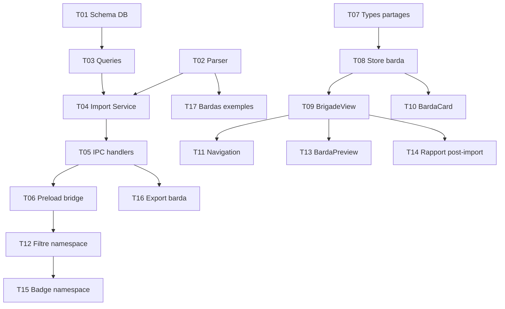

# Taches — Barda (Gestion de Brigade)

**Date** : 2026-03-20
**Nombre de taches** : 17
**Phases** : P0 (12 taches), P1 (3 taches), P2 (2 taches)

## Taches

### T01 · Schema DB + migrations

**Phase** : P0
**But** : Creer la table `bardas` et ajouter la colonne `namespace` sur 6 tables existantes

**Fichiers concernes** :
- `[MODIFY]` `src/main/db/schema.ts` — ajouter table `bardas` (Drizzle)
- `[MODIFY]` `src/main/db/migrate.ts` — CREATE TABLE bardas + 6 ALTER TABLE + 7 CREATE INDEX

**Piste** : backend

**Dependances** : aucune

**Securite** : namespace valide par regex dans le schema Zod (pas au niveau DB)

**Criteres d'acceptation** :
- [ ] Table `bardas` creee avec tous les champs (id, namespace UNIQUE, name, description, version, author, isEnabled, 6 compteurs, timestamps)
- [ ] Colonne `namespace TEXT` ajoutee sur roles, slash_commands, prompts, memory_fragments, libraries, mcp_servers
- [ ] ALTER TABLE idempotent (try/catch, meme pattern que `is_favorite`)
- [ ] 7 index crees (idx_bardas_namespace + 6 idx_*_namespace)
- [ ] Cleanup dans `cleanup.ts` : `bardas` supprime AVANT les tables qui portent le namespace (pas de FK cascade)

---

### T02 · BardaParserService

**Phase** : P0
**But** : Parser un fichier Markdown au format barda en structure de donnees intermediaire

**Fichiers concernes** :
- `[NEW]` `src/main/services/barda-parser.service.ts`

**Piste** : backend

**Dependances** : aucune

**Securite** : sanitization XML/HTML sur les contenus texte (escape `<`, `>`, `&`)

**Criteres d'acceptation** :
- [ ] Parse le frontmatter YAML (champs name, namespace obligatoires ; version, description, author optionnels)
- [ ] Valide le namespace via regex `/^[a-z][a-z0-9-]*$/`
- [ ] Parse les sections `## Roles`, `## Commands`, `## Prompts`, `## Memory Fragments`, `## Libraries`, `## MCP`
- [ ] Parse les ressources `### Nom` + body (texte jusqu'au prochain ### ou ##)
- [ ] Section `## MCP` : parse le bloc fenced YAML dans le body (transportType, command, args, url, headers)
- [ ] Sections inconnues ignorees silencieusement (forward-compatible)
- [ ] Retourne `ParsedBarda` si valide, `ParseError` si invalide
- [ ] `ParseError` contient le numero de ligne et un message explicite
- [ ] Sanitize les contenus texte (escape XML/HTML)
- [ ] Rejet si frontmatter absent ou invalide
- [ ] Rejet si aucune section non-vide
- [ ] Singleton export : `export const bardaParserService = new BardaParserService()`

---

### T03 · Queries bardas

**Phase** : P0
**But** : CRUD pour la table bardas + queries de suppression par namespace

**Fichiers concernes** :
- `[NEW]` `src/main/db/queries/bardas.ts`

**Piste** : backend

**Dependances** : T01

**Criteres d'acceptation** :
- [ ] `createBarda(data)` : INSERT dans bardas
- [ ] `listBardas()` : SELECT * FROM bardas ORDER BY name
- [ ] `getBardaByNamespace(namespace)` : SELECT WHERE namespace = ?
- [ ] `toggleBarda(id, isEnabled)` : UPDATE isEnabled
- [ ] `deleteBarda(id)` : DELETE FROM bardas WHERE id = ?
- [ ] `deleteResourcesByNamespace(namespace)` : DELETE sur 6 tables (roles, slash_commands, prompts, memory_fragments, libraries, mcp_servers) WHERE namespace = ?
- [ ] Ordre de suppression : library_chunks → library_sources → libraries (respecter FK), puis les autres tables sans FK
- [ ] `countActiveFragments()` : COUNT(*) FROM memory_fragments WHERE is_active = 1

---

### T04 · BardaImportService

**Phase** : P0
**But** : Import atomique d'un barda parse en base de donnees

**Fichiers concernes** :
- `[NEW]` `src/main/services/barda-import.service.ts`

**Piste** : backend

**Dependances** : T02, T03

**Securite** : transaction atomique, verification namespace unique, verification capacite fragments

**Criteres d'acceptation** :
- [ ] Recoit un `ParsedBarda` et execute l'import dans une transaction SQLite
- [ ] Verifie que le namespace n'existe pas deja (query `getBardaByNamespace`)
- [ ] Verifie que les memory fragments ne depassent pas la limite (50 total)
- [ ] INSERT barda dans table `bardas` avec compteurs
- [ ] INSERT roles avec `namespace` propage, nom prefixe `namespace:nom` dans le champ `name`
- [ ] INSERT slash_commands avec `namespace` propage, nom prefixe `namespace:nom`
- [ ] INSERT prompts avec `namespace` propage, titre prefixe `namespace:titre`
- [ ] INSERT memory_fragments avec `namespace` propage, `isActive: true`, `sortOrder` auto-increment
- [ ] INSERT libraries avec `namespace` propage, status `empty` (pas d'indexation)
- [ ] INSERT mcp_servers : skip si un serveur avec le meme nom existe deja, ajouter au rapport
- [ ] Rollback complet si une INSERT echoue
- [ ] Retourne `BardaImportReport` : { bardaId, succes: string[], skips: { type, name, reason }[], warnings: string[] }
- [ ] Singleton export : `export const bardaImportService = new BardaImportService()`

---

### T05 · IPC handlers

**Phase** : P0
**But** : Exposer les 5 handlers IPC pour le barda

**Fichiers concernes** :
- `[NEW]` `src/main/ipc/barda.ipc.ts`
- `[MODIFY]` `src/main/ipc/index.ts` — registerBardaHandlers

**Piste** : backend

**Dependances** : T04

**Securite** : Zod validation sur tous les payloads, taille fichier max 1 MB

**Criteres d'acceptation** :
- [ ] `barda:import` : lit le fichier (taille max 1 MB), parse, importe, retourne rapport
- [ ] `barda:preview` : lit le fichier, parse, retourne ParsedBarda ou ParseError (pas d'import)
- [ ] `barda:list` : retourne la liste des bardas
- [ ] `barda:toggle` : toggle isEnabled d'un barda
- [ ] `barda:uninstall` : supprime le barda + toutes les ressources du namespace (avec confirmation)
- [ ] Zod schemas pour chaque payload
- [ ] Enregistre dans `registerBardaHandlers()` appele depuis index.ts

---

### T06 · Preload bridge

**Phase** : P0
**But** : Exposer les methodes barda dans window.api

**Fichiers concernes** :
- `[MODIFY]` `src/preload/index.ts`

**Piste** : bridge

**Dependances** : T05

**Criteres d'acceptation** :
- [ ] `bardaImport(filePath: string)` → invoke `barda:import`
- [ ] `bardaPreview(filePath: string)` → invoke `barda:preview`
- [ ] `bardaList()` → invoke `barda:list`
- [ ] `bardaToggle(id: string, isEnabled: boolean)` → invoke `barda:toggle`
- [ ] `bardaUninstall(id: string)` → invoke `barda:uninstall`

---

### T07 · Types partages

**Phase** : P0
**But** : Definir les types DTOs pour le barda

**Fichiers concernes** :
- `[MODIFY]` `src/preload/types.ts`

**Piste** : bridge

**Dependances** : aucune

**Criteres d'acceptation** :
- [ ] `BardaInfo` : id, namespace, name, description, version, author, isEnabled, 6 compteurs, createdAt
- [ ] `ParsedBarda` : metadata (name, namespace, version, description, author) + sections: { roles, commands, prompts, fragments, libraries, mcp } (arrays de ParsedResource)
- [ ] `ParsedResource` : name, content (texte body), + pour MCP : mcpConfig (transportType, command, args, url, headers)
- [ ] `BardaImportReport` : bardaId, succes: string[], skips: { type: string, name: string, reason: string }[], warnings: string[]
- [ ] `BardaParseError` : line: number, message: string

---

### T08 · Store barda

**Phase** : P0
**But** : Store Zustand pour les bardas

**Fichiers concernes** :
- `[NEW]` `src/renderer/src/stores/barda.store.ts`

**Piste** : frontend

**Dependances** : T07

**Criteres d'acceptation** :
- [ ] State : `bardas: BardaInfo[]`, `isLoading: boolean`
- [ ] Actions : `loadBardas()`, `importBarda(filePath)`, `toggleBarda(id, isEnabled)`, `uninstallBarda(id)`
- [ ] `loadBardas` appelle `window.api.bardaList()` et hydrate le state
- [ ] Pattern identique aux autres stores (conversations.store, library.store)

---

### T09 · BrigadeView

**Phase** : P0
**But** : Vue principale de gestion des bardas

**Fichiers concernes** :
- `[NEW]` `src/renderer/src/components/brigade/BrigadeView.tsx`

**Piste** : frontend

**Dependances** : T08

**Criteres d'acceptation** :
- [ ] Header avec titre "Gestion de Brigade" + bouton "Importer un barda"
- [ ] Grille de BardaCard (meme layout que LibrariesView — cards colorees)
- [ ] Bouton import ouvre dialog natif `showOpenDialog` (filtre `.md`)
- [ ] Etat vide : message d'accueil expliquant le concept de barda
- [ ] Appel `loadBardas()` au mount
- [ ] Pattern vue inline (pas de modal), coherent avec les autres vues

---

### T10 · BardaCard

**Phase** : P0
**But** : Card d'un barda dans la grille

**Fichiers concernes** :
- `[NEW]` `src/renderer/src/components/brigade/BardaCard.tsx`

**Piste** : frontend

**Dependances** : T08

**Criteres d'acceptation** :
- [ ] Affiche : name, namespace (badge), description, version, author
- [ ] Compteurs par type de ressource (roles, commands, prompts, fragments, libraries, MCP)
- [ ] Toggle switch ON/OFF (appelle `toggleBarda`)
- [ ] Bouton "Desinstaller" (avec confirmation dialog)
- [ ] Indicateur visuel ON/OFF (opacite reduite quand OFF)

---

### T11 · Navigation

**Phase** : P0
**But** : Integrer BrigadeView dans la navigation de l'app

**Fichiers concernes** :
- `[MODIFY]` `src/renderer/src/App.tsx` — lazy import + route `brigade`
- `[MODIFY]` `src/renderer/src/components/layout/UserMenu.tsx` — entree "Brigade" dans sous-menu Personnalisation
- `[MODIFY]` `src/renderer/src/components/common/CommandPalette.tsx` — entree brigade
- `[MODIFY]` `src/renderer/src/stores/ui.store.ts` — ajouter `'brigade'` au type ViewMode

**Piste** : frontend

**Dependances** : T09

**Criteres d'acceptation** :
- [ ] `ViewMode` inclut `'brigade'`
- [ ] BrigadeView lazy-loaded dans App.tsx (React.lazy + Suspense)
- [ ] Entree "Brigade" dans UserMenu (sous-menu Personnalisation, icone Shield ou Sword)
- [ ] Entree "Brigade" dans CommandPalette
- [ ] Navigation fonctionne depuis les 3 points d'entree

---

### T12 · Filtre namespace

**Phase** : P0
**But** : Masquer les ressources des bardas desactives dans les vues existantes

**Fichiers concernes** :
- `[MODIFY]` `src/renderer/src/components/roles/RolesView.tsx`
- `[MODIFY]` `src/renderer/src/components/commands/CommandsView.tsx`
- `[MODIFY]` `src/renderer/src/components/prompts/PromptsView.tsx`
- `[MODIFY]` `src/renderer/src/components/settings/MemoryFragmentsSection.tsx` (ou equivalent)
- `[MODIFY]` `src/renderer/src/components/libraries/LibrariesView.tsx`
- `[MODIFY]` `src/renderer/src/components/mcp/McpView.tsx`

**Piste** : frontend

**Dependances** : T06 (preload bridge pour charger les bardas et connaitre les disabled)

**Criteres d'acceptation** :
- [ ] Chaque vue filtre les ressources dont le `namespace` appartient a un barda desactive
- [ ] Le store barda fournit un set `disabledNamespaces` derive des bardas avec `isEnabled = false`
- [ ] Les ressources custom (namespace = null) sont toujours visibles
- [ ] Les ressources de bardas actifs sont visibles
- [ ] Pas de modification backend — le filtre est 100% renderer

---

### T13 · BardaPreview

**Phase** : P1
**But** : Preview du contenu d'un barda avant import

**Fichiers concernes** :
- `[NEW]` `src/renderer/src/components/brigade/BardaPreview.tsx`
- `[MODIFY]` `src/renderer/src/components/brigade/BrigadeView.tsx`

**Piste** : frontend

**Dependances** : T09

**Criteres d'acceptation** :
- [ ] Apres selection du fichier, appelle `window.api.bardaPreview(filePath)`
- [ ] Affiche les sections avec compteurs (ex: "3 roles, 5 commands, 2 prompts...")
- [ ] Affiche les noms des ressources par section
- [ ] Boutons "Confirmer l'import" / "Annuler"
- [ ] Si ParseError : affiche l'erreur (ligne + message) et pas de bouton confirmer
- [ ] Si namespace deja existant : message d'erreur explicite

---

### T14 · Rapport post-import

**Phase** : P1
**But** : Afficher un rapport detaille apres l'import

**Fichiers concernes** :
- `[MODIFY]` `src/renderer/src/components/brigade/BrigadeView.tsx`

**Piste** : frontend

**Dependances** : T09

**Criteres d'acceptation** :
- [ ] Apres import reussi, affiche un dialog/section avec le rapport
- [ ] Liste les ressources importees avec succes (par type)
- [ ] Liste les MCP skippes avec la raison ("serveur 'context7' existe deja")
- [ ] Liste les warnings eventuels
- [ ] Bouton "Fermer" qui revient a la grille

---

### T15 · Badge namespace

**Phase** : P1
**But** : Indicateur visuel du namespace sur les ressources de barda dans les vues existantes

**Fichiers concernes** :
- `[MODIFY]` `src/renderer/src/components/roles/RolesView.tsx`
- `[MODIFY]` `src/renderer/src/components/commands/CommandsView.tsx`
- `[MODIFY]` `src/renderer/src/components/prompts/PromptsView.tsx`

**Piste** : frontend

**Dependances** : T12

**Criteres d'acceptation** :
- [ ] Les ressources avec un namespace affichent un petit badge colore (ex: badge "ecrivain" en teal)
- [ ] Les ressources custom (namespace null) n'ont pas de badge
- [ ] Le badge utilise la meme couleur que la BardaCard correspondante
- [ ] Cliquer sur le badge navigue vers la BrigadeView (optionnel)

---

### T16 · Export barda

**Phase** : P2
**But** : Generer un fichier .md barda a partir des ressources d'un namespace

**Fichiers concernes** :
- `[NEW]` `src/main/services/barda-export.service.ts`
- `[MODIFY]` `src/main/ipc/barda.ipc.ts` — +handler `barda:export`
- `[MODIFY]` `src/preload/index.ts` — +methode
- `[MODIFY]` `src/renderer/src/components/brigade/BardaCard.tsx` — +bouton "Exporter"

**Piste** : fullstack

**Dependances** : T05

**Criteres d'acceptation** :
- [ ] Genere un fichier .md valide a partir du barda en DB
- [ ] Le fichier genere est re-importable (roundtrip)
- [ ] Dialog natif saveDialog pour choisir le chemin de sauvegarde
- [ ] Frontmatter reconstitue (name, namespace, version, description, author)

---

### T17 · Bardas exemples

**Phase** : P2
**But** : Creer 2-3 fichiers barda d'exemple

**Fichiers concernes** :
- `[NEW]` `examples/barda-ecrivain.md`
- `[NEW]` `examples/barda-dev-react.md`
- `[NEW]` `examples/barda-philosophe.md`

**Piste** : fullstack

**Dependances** : T02 (parseur fonctionnel pour valider les exemples)

**Criteres d'acceptation** :
- [ ] `barda-ecrivain.md` : 4 roles, 7 commands, 3 prompts, 2 fragments, 1 library
- [ ] `barda-dev-react.md` : 3 roles, 5 commands, 2 prompts, 1 MCP (context7)
- [ ] `barda-philosophe.md` : 3 roles, 4 commands, 3 prompts, 2 fragments
- [ ] Chaque fichier est valide et importable
- [ ] Contenu de qualite (system prompts bien rediges, pas du lorem ipsum)

---

## Graphe de dependances

## Indicateurs de parallelisme

### Pistes identifiees

| Piste | Taches | Repertoire |
|-------|--------|------------|
| backend | T01, T02, T03, T04, T05 | src/main/ |
| bridge | T06, T07 | src/preload/ |
| frontend | T08, T09, T10, T11, T12, T13, T14, T15 | src/renderer/ |

### Fichiers partages entre pistes

| Fichier | Taches | Risque de conflit |
|---------|--------|-------------------|
| `src/preload/types.ts` | T07 (bridge) + tous les frontend | Faible — T07 ajoute des types, les autres les consomment |
| `src/preload/index.ts` | T06 (bridge) | Aucun — seul T06 touche ce fichier |

### Chemin critique

T01 → T03 → T04 → T05 → T06 → T12

Le backend (T01-T05) est la chaine la plus longue. Le frontend (T08-T11) peut demarrer en parallele des que T07 (types) est fait.
