# Plan de developpement — refactor-workspace-sandbox

**Date** : 2026-03-23
**Contexte** : architecture-technique.md, brainstorming.md

## Vue d'ensemble

```
                    ┌─────────────────────┐
                    │   SUPPRESSION        │
                    │   Git (12 fichiers)  │
                    │   YOLO (9 fichiers)  │
                    └────────┬────────────┘
                             │
                    ┌────────▼────────────┐
                    │   MIGRATION DB       │
                    │   workspace_path     │
                    │   sur conversations  │
                    └────────┬────────────┘
                             │
              ┌──────────────┼──────────────┐
              │              │              │
    ┌─────────▼──────┐ ┌────▼──────┐ ┌─────▼──────────┐
    │ TOOLS UNIFIES  │ │ CHAT.IPC  │ │ UI REFACTOR    │
    │ conversation-  │ │ un seul   │ │ OptionsSection │
    │ tools.ts       │ │ chemin    │ │ WorkspacePanel │
    └─────────┬──────┘ └────┬──────┘ └─────┬──────────┘
              │              │              │
              └──────────────┼──────────────┘
                             │
                    ┌────────▼────────────┐
                    │   NETTOYAGE         │
                    │   Code mort         │
                    │   Preload/Types     │
                    └─────────────────────┘
```

## Modele de donnees

```
projects
  ├── id (PK)
  ├── name
  ├── description
  ├── system_prompt
  ├── default_model_id
  ├── color
  ├── default_workspace_path  [RENAME]    ← ex workspace_path
  ├── created_at
  └── updated_at

conversations
  ├── id (PK)
  ├── title
  ├── project_id (FK)
  ├── workspace_path  [NEW]              ← NOT NULL DEFAULT '~/.cruchot/sandbox/'
  ├── is_favorite
  ├── is_arena
  ├── created_at
  └── updated_at

-- SUPPRIME : is_yolo, sandbox_path, idx_conversations_is_yolo
```

## Phases de developpement

### P0 — Refactoring core

| # | Tache | Detail |
|---|-------|--------|
| 1 | Supprimer Git (backend) | Delete git.service.ts, git.ipc.ts. Nettoyer ipc/index.ts, workspace.ipc.ts |
| 2 | Supprimer Git (frontend) | Delete ChangesPanel, DiffView, GitBranchBadge, git.store.ts. Modifier WorkspacePanel, FileTree |
| 3 | Supprimer YOLO/Sandbox (backend) | Delete sandbox.service.ts, process-manager.service.ts, sandbox.ipc.ts, yolo-tools.ts, yolo-prompt.ts. Nettoyer ipc/index.ts, chat.ipc.ts, index.ts |
| 4 | Supprimer YOLO/Sandbox (frontend) | Delete YoloToggle, YoloStatusBar, sandbox.store.ts. Modifier ChatView, OptionsSection, providers.store |
| 5 | Migration DB | workspace_path sur conversations, renommer sur projects, migration donnees, drop index YOLO |
| 6 | Tools unifies | Creer conversation-tools.ts (fusion), adapter seatbelt.ts |
| 7 | Chat.ipc.ts refactor | Un seul chemin tools, workspace_path depuis la conversation |
| 8 | UI — Selecteur dossier | OptionsSection : selecteur de dossier, IPC update workspace_path |
| 9 | UI — WorkspacePanel | Piloter par conversation.workspace_path, creation auto ~/.cruchot/sandbox/ |
| 10 | Preload/Types cleanup | Retirer git (8 methodes), sandbox (6 methodes), types morts |

### P1 — Polish

| # | Tache | Detail |
|---|-------|--------|
| 11 | Heritage dossier projet | Nouvelle conversation herite defaultWorkspacePath du projet |
| 12 | Nettoyage code mort global | Grep pour references residuelles git/yolo/sandbox, supprimer |

## Tests

- **Strategie** : verification manuelle (pas de tests automatises dans le projet)
- **Checklist P0** :
  - [ ] Typecheck renderer : 0 erreurs
  - [ ] Typecheck main : 0 erreurs (hors continue-on-error existants)
  - [ ] App demarre sans crash
  - [ ] Nouvelle conversation a un workspace_path en DB
  - [ ] Tools fonctionnent dans le dossier par defaut (~/.cruchot/sandbox/)
  - [ ] Tools fonctionnent dans un vrai dossier choisi
  - [ ] WorkspacePanel affiche l'arbre du dossier de la conversation
  - [ ] Pas de reference a Git dans l'UI
  - [ ] Pas de reference a YOLO/Sandbox dans l'UI

## Ordre d'execution

```mermaid
gantt
    title Refactor Workspace Sandbox
    dateFormat X
    axisFormat %s

    section Suppression
    T01 Git backend           :t1, 0, 1
    T02 Git frontend          :t2, 0, 1
    T03 YOLO backend          :t3, 0, 1
    T04 YOLO frontend         :t4, 0, 1

    section Core
    T05 Migration DB          :t5, after t1 t3, 1
    T06 Tools unifies         :t6, after t3, 1
    T07 Chat.ipc.ts           :t7, after t5 t6, 1

    section UI
    T08 Selecteur dossier     :t8, after t4 t5, 1
    T09 WorkspacePanel        :t9, after t2 t5, 1

    section Cleanup
    T10 Preload/Types         :t10, after t1 t2 t3 t4, 1
    T11 Heritage projet       :t11, after t7, 1
    T12 Code mort             :t12, after t7 t8 t9 t10, 1
```



## Checklist de lancement
- [ ] Toutes les taches P0 terminees
- [ ] Typecheck 0 erreurs
- [ ] App demarre et fonctionne
- [ ] Migration DB testee sur une copie
- [ ] Conversations existantes migreees
- [ ] `~/.cruchot/sandbox/` cree au demarrage
