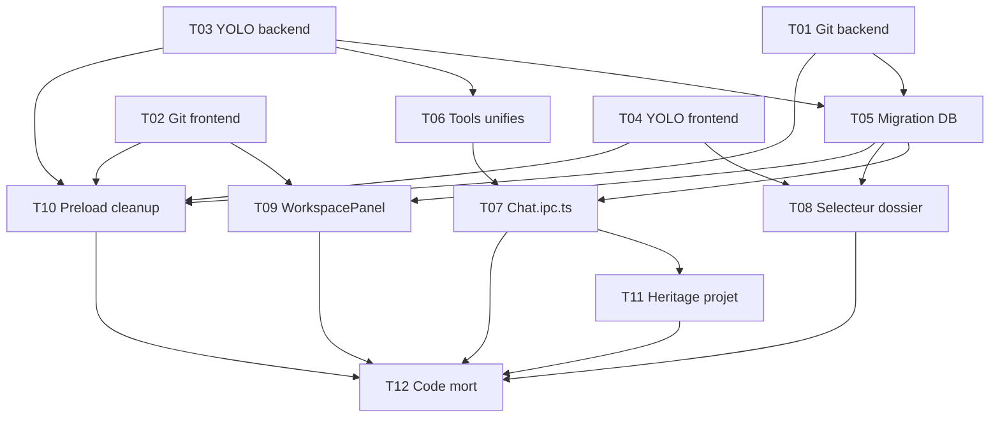

# Taches — refactor-workspace-sandbox

**Date** : 2026-03-23
**Nombre de taches** : 12
**Phases** : P0 (10 taches), P1 (2 taches)

## Taches

### T01 · Supprimer Git (backend)

**Phase** : P0
**But** : Retirer tout le code Git du main process

**Fichiers concernes** :
- `[DELETE]` `src/main/services/git.service.ts`
- `[DELETE]` `src/main/ipc/git.ipc.ts`
- `[MODIFY]` `src/main/ipc/index.ts` — retirer import + registerGitIpc()
- `[MODIFY]` `src/main/ipc/workspace.ipc.ts` — retirer imports onWorkspaceFileChanged, resetGitService

**Piste** : backend

**Dependances** : aucune

**Criteres d'acceptation** :
- [ ] git.service.ts et git.ipc.ts supprimes
- [ ] Aucune reference a git dans ipc/index.ts
- [ ] workspace.ipc.ts ne reference plus git.ipc
- [ ] Compilation main OK (les erreurs frontend sont attendues, traitees en T02)

---

### T02 · Supprimer Git (frontend)

**Phase** : P0
**But** : Retirer tout le code Git du renderer

**Fichiers concernes** :
- `[DELETE]` `src/renderer/src/stores/git.store.ts`
- `[DELETE]` `src/renderer/src/components/workspace/ChangesPanel.tsx`
- `[DELETE]` `src/renderer/src/components/workspace/DiffView.tsx`
- `[DELETE]` `src/renderer/src/components/workspace/GitBranchBadge.tsx`
- `[MODIFY]` `src/renderer/src/components/workspace/WorkspacePanel.tsx` — retirer onglet Git, imports git.store, ChangesPanel, GitBranchBadge
- `[MODIFY]` `src/renderer/src/components/workspace/FileTree.tsx` — retirer decorations git status (couleurs M/A/D/R/?)

**Piste** : frontend

**Dependances** : aucune

**Criteres d'acceptation** :
- [ ] 4 fichiers supprimes
- [ ] WorkspacePanel n'a plus d'onglet "Changes"
- [ ] FileTree n'affiche plus les indicateurs git
- [ ] Aucune reference a git.store dans le renderer
- [ ] Compilation renderer OK

---

### T03 · Supprimer YOLO/Sandbox (backend)

**Phase** : P0
**But** : Retirer tout le code YOLO/Sandbox du main process

**Fichiers concernes** :
- `[DELETE]` `src/main/services/sandbox.service.ts`
- `[DELETE]` `src/main/services/process-manager.service.ts`
- `[DELETE]` `src/main/ipc/sandbox.ipc.ts`
- `[DELETE]` `src/main/llm/yolo-tools.ts`
- `[DELETE]` `src/main/llm/yolo-prompt.ts`
- `[MODIFY]` `src/main/ipc/index.ts` — retirer import + registerSandboxIpc()
- `[MODIFY]` `src/main/ipc/chat.ipc.ts` — retirer imports yolo (buildYoloTools, buildYoloSystemPrompt, sandboxService), retirer logique isYolo/sandboxDir
- `[MODIFY]` `src/main/index.ts` — retirer cleanup YOLO orphelins, retirer processManagerService imports
- `[MODIFY]` `src/main/llm/registry.ts` — retirer `supportsYolo` de tous les modeles (~20)
- `[MODIFY]` `src/main/llm/types.ts` — retirer `supportsYolo` de ModelDefinition
- `[MODIFY]` `src/main/ipc/providers.ipc.ts` — retirer `supportsYolo` des modeles custom
- `[MODIFY]` `src/main/db/queries/conversations.ts` — retirer setConversationYolo(), getYoloConversations(), isYolo dans forkConversation()

**Piste** : backend

**Dependances** : aucune

**Securite** : Garder `seatbelt.ts` — il sera reutilise par les tools unifies (T06)

**Criteres d'acceptation** :
- [ ] 5 fichiers supprimes
- [ ] Aucune reference a yolo/sandbox dans ipc/index.ts
- [ ] chat.ipc.ts n'a plus de logique isYolo
- [ ] registry.ts n'a plus de supportsYolo
- [ ] seatbelt.ts est intact
- [ ] Compilation main OK (les erreurs frontend sont attendues)

---

### T04 · Supprimer YOLO/Sandbox (frontend)

**Phase** : P0
**But** : Retirer tout le code YOLO/Sandbox du renderer

**Fichiers concernes** :
- `[DELETE]` `src/renderer/src/stores/sandbox.store.ts`
- `[DELETE]` `src/renderer/src/components/chat/YoloToggle.tsx`
- `[DELETE]` `src/renderer/src/components/chat/YoloStatusBar.tsx`
- `[MODIFY]` `src/renderer/src/components/chat/ChatView.tsx` — retirer imports sandbox.store, YoloStatusBar
- `[MODIFY]` `src/renderer/src/components/chat/right-panel/OptionsSection.tsx` — retirer import YoloToggle, retirer le composant du rendu
- `[MODIFY]` `src/renderer/src/stores/providers.store.ts` — retirer supportsYolo

**Piste** : frontend

**Dependances** : aucune

**Criteres d'acceptation** :
- [ ] 3 fichiers supprimes
- [ ] Aucune reference a sandbox/yolo dans le renderer
- [ ] OptionsSection n'affiche plus le YoloToggle
- [ ] ChatView n'affiche plus la YoloStatusBar
- [ ] Compilation renderer OK

---

### T05 · Migration DB

**Phase** : P0
**But** : Ajouter workspace_path sur conversations, renommer sur projects, migrer les donnees

**Fichiers concernes** :
- `[MODIFY]` `src/main/db/schema.ts` — ajouter workspace_path sur conversations, retirer is_yolo/sandbox_path, renommer workspacePath en defaultWorkspacePath sur projects (alias Drizzle)
- `[MODIFY]` `src/main/db/migrate.ts` — ALTER TABLE ADD COLUMN, UPDATE migration, DROP INDEX
- `[MODIFY]` `src/main/db/queries/conversations.ts` — ajouter setWorkspacePath(), getWorkspacePath()
- `[MODIFY]` `src/main/index.ts` — creer ~/.cruchot/sandbox/ au demarrage (mkdirSync recursive)

**Piste** : backend

**Dependances** : T01, T03 (pour eviter les conflits sur schema.ts)

**Criteres d'acceptation** :
- [ ] conversations.workspace_path existe en DB (NOT NULL, default ~/.cruchot/sandbox/)
- [ ] Conversations existantes avec un projet ayant workspacePath sont migrees
- [ ] is_yolo et sandbox_path ne sont plus dans le schema Drizzle
- [ ] idx_conversations_is_yolo supprime
- [ ] ~/.cruchot/sandbox/ cree au demarrage
- [ ] App demarre sans erreur DB

---

### T06 · Tools unifies

**Phase** : P0
**But** : Creer un seul fichier de tools pour toutes les conversations

**Fichiers concernes** :
- `[NEW]` `src/main/llm/conversation-tools.ts` — 4 tools : bash (libre, Seatbelt), readFile, writeFile, listFiles
- `[DELETE]` `src/main/llm/workspace-tools.ts` (apres creation du nouveau)

**Piste** : backend

**Dependances** : T03 (yolo-tools.ts doit etre supprime avant)

**Securite** :
- Bash libre (pas de blocklist applicative), confine par Seatbelt via `execSandboxed()`
- Path validation : `realpathSync() + startsWith(workspacePath + path.sep)`
- readFile : whitelist extensions (~80), max 5MB
- writeFile : max 5MB, creation auto parents
- listFiles : max 500 entrees
- `buildWorkspaceContextBlock()` deplace dans ce fichier

**Criteres d'acceptation** :
- [ ] conversation-tools.ts exporte `buildConversationTools(workspacePath: string)`
- [ ] 4 tools definis avec inputSchema Zod (AI SDK v6)
- [ ] Bash utilise execSandboxed() de seatbelt.ts
- [ ] Path validation sur readFile/writeFile/listFiles
- [ ] buildWorkspaceContextBlock() disponible
- [ ] workspace-tools.ts supprime
- [ ] Compilation main OK

---

### T07 · Chat.ipc.ts refactor

**Phase** : P0
**But** : Un seul chemin tools dans le handler de chat

**Fichiers concernes** :
- `[MODIFY]` `src/main/ipc/chat.ipc.ts` — remplacer la logique dual (workspace/yolo) par un seul appel buildConversationTools(conversation.workspacePath)

**Piste** : backend

**Dependances** : T05 (workspace_path en DB), T06 (tools unifies)

**Criteres d'acceptation** :
- [ ] Plus de variable isYolo, sandboxDir
- [ ] Plus de hasWorkspace boolean dans le payload
- [ ] workspace_path lu depuis la conversation en DB
- [ ] buildConversationTools(workspacePath) appele systematiquement
- [ ] buildWorkspaceContextBlock(workspacePath) appele systematiquement
- [ ] MCP tools merges comme avant
- [ ] Compilation main OK

---

### T08 · UI — Selecteur de dossier dans OptionsSection

**Phase** : P0
**But** : Remplacer le YoloToggle par un selecteur de dossier de travail

**Fichiers concernes** :
- `[MODIFY]` `src/renderer/src/components/chat/right-panel/OptionsSection.tsx` — ajouter selecteur de dossier (bouton FolderOpen + path affiche + bouton reset)
- `[MODIFY]` `src/preload/index.ts` — ajouter methode `conversationSetWorkspacePath(id, path)`
- `[MODIFY]` `src/preload/types.ts` — ajouter type
- `[MODIFY]` `src/main/ipc/conversations.ipc.ts` — ajouter handler IPC `conversations:setWorkspacePath`

**Piste** : fullstack

**Dependances** : T04 (YoloToggle supprime), T05 (workspace_path en DB)

**Criteres d'acceptation** :
- [ ] OptionsSection affiche le dossier courant (path tronque)
- [ ] Bouton FolderOpen ouvre un dialog natif de selection de dossier
- [ ] Bouton reset remet le defaut (~/.cruchot/sandbox/)
- [ ] Le changement persiste en DB via IPC
- [ ] Le WorkspacePanel se met a jour quand le dossier change
- [ ] Validation : dossiers bloques rejetes (/, /System, etc.)

---

### T09 · UI — WorkspacePanel pilote par conversation

**Phase** : P0
**But** : Le WorkspacePanel affiche l'arbre du dossier de la conversation (plus du projet)

**Fichiers concernes** :
- `[MODIFY]` `src/renderer/src/components/workspace/WorkspacePanel.tsx` — piloter par conversation.workspace_path
- `[MODIFY]` `src/renderer/src/stores/workspace.store.ts` — rootPath derive de la conversation active
- `[MODIFY]` `src/renderer/src/components/chat/ChatView.tsx` — sync workspace rootPath depuis conversation.workspace_path

**Piste** : frontend

**Dependances** : T02 (Git supprime de WorkspacePanel), T05 (workspace_path en DB)

**Criteres d'acceptation** :
- [ ] WorkspacePanel affiche l'arbre du dossier de la conversation
- [ ] Switch de conversation → WorkspacePanel se met a jour
- [ ] Dossier par defaut (~/.cruchot/sandbox/) affiche un arbre (possiblement vide)
- [ ] Pas d'onglet Git

---

### T10 · Preload/Types cleanup

**Phase** : P0
**But** : Nettoyer le bridge IPC des methodes et types supprimes

**Fichiers concernes** :
- `[MODIFY]` `src/preload/index.ts` — retirer 8 methodes git + 6 methodes sandbox
- `[MODIFY]` `src/preload/types.ts` — retirer GitFileStatusCode, GitFileStatus, GitInfo, SandboxInfo, SandboxProcessInfo, supportsYolo

**Piste** : fullstack

**Dependances** : T01, T02, T03, T04 (tout le code qui utilise ces methodes doit etre supprime avant)

**Criteres d'acceptation** :
- [ ] Aucune methode git* dans preload
- [ ] Aucune methode sandbox* dans preload
- [ ] Aucun type Git/Sandbox dans types.ts
- [ ] supportsYolo retire de l'interface modele
- [ ] Compilation preload OK

---

### T11 · Heritage dossier projet → conversation

**Phase** : P1
**But** : Les nouvelles conversations heritent du defaultWorkspacePath de leur projet

**Fichiers concernes** :
- `[MODIFY]` `src/main/db/queries/conversations.ts` — createConversation() lit le defaultWorkspacePath du projet
- `[MODIFY]` `src/main/ipc/conversations.ipc.ts` — passer le workspace_path a la creation

**Piste** : backend

**Dependances** : T05, T07

**Criteres d'acceptation** :
- [ ] Nouvelle conversation dans un projet avec defaultWorkspacePath → herite du path
- [ ] Nouvelle conversation sans projet → defaut ~/.cruchot/sandbox/
- [ ] Nouvelle conversation dans un projet sans defaultWorkspacePath → defaut ~/.cruchot/sandbox/

---

### T12 · Nettoyage code mort global

**Phase** : P1
**But** : Verifier qu'aucune reference residuelle a Git/YOLO/Sandbox ne subsiste

**Fichiers concernes** :
- `[MODIFY]` Tout fichier avec une reference residuelle

**Piste** : fullstack

**Dependances** : T07, T08, T09, T10

**Criteres d'acceptation** :
- [ ] `grep -r "gitGet\|gitStage\|gitCommit\|gitGenerate\|GitService\|git\.store" src/` retourne 0
- [ ] `grep -r "sandbox\|yolo\|isYolo\|sandboxPath\|supportsYolo\|YoloToggle\|YoloStatusBar" src/` retourne 0 (hors commentaires)
- [ ] `grep -r "ProcessManager\|SandboxService" src/` retourne 0
- [ ] Typecheck renderer : 0 erreurs
- [ ] Typecheck main : 0 nouvelles erreurs

---

## Graphe de dependances

## Indicateurs de parallelisme

### Pistes identifiees
| Piste | Taches | Repertoire |
|-------|--------|------------|
| backend | T01, T03, T05, T06, T07, T11 | src/main/ |
| frontend | T02, T04, T08, T09 | src/renderer/ |
| fullstack | T10, T12 | src/preload/ + grep global |

### Fichiers partages entre pistes
| Fichier | Taches | Risque de conflit |
|---------|--------|-------------------|
| src/main/db/schema.ts | T03, T05 | Moyen — T03 retire is_yolo, T05 ajoute workspace_path |
| src/main/ipc/index.ts | T01, T03 | Faible — chacun retire sa ligne |
| src/main/ipc/chat.ipc.ts | T03, T07 | Eleve — T03 retire yolo, T07 refactore. Faire T03 avant T07 |
| src/preload/index.ts | T08, T10 | Moyen — T10 retire, T08 ajoute |
| OptionsSection.tsx | T04, T08 | Moyen — T04 retire YoloToggle, T08 ajoute selecteur |

### Chemin critique
T03 → T06 → T07 → T11 → T12
