# Plan de developpement — Right Panel

**Date** : 2026-03-22
**Contexte** : architecture-technique.md, brainstorming.md

## Vue d'ensemble

```
┌─────────┐  ┌──────────────────────────────┐  ┌──────────────┐
│ Sidebar │  │         ChatView             │  │  RightPanel  │
│ (left)  │  │  ┌────────────────────────┐  │  │  ┌────────┐  │
│ 260px   │  │  │ YoloStatusBar          │  │  │  │Params  │  │
│         │  │  ├────────────────────────┤  │  │  │(model, │  │
│         │  │  │                        │  │  │  │think,  │  │
│         │  │  │    MessageList          │  │  │  │role,   │  │
│         │  │  │                        │  │  │  │web,    │  │
│         │  │  │                        │  │  │  │tokens) │  │
│         │  │  │                        │  │  │  ├────────┤  │
│         │  │  ├────────────────────────┤  │  │  │Options │  │
│         │  │  │ InputZone (simplifie)  │  │  │  │(prompt,│  │
│         │  │  │ [clip] [textarea] [mic]│  │  │  │lib,    │  │
│         │  │  │                [send]  │  │  │  │yolo)   │  │
│         │  │  └────────────────────────┘  │  │  ├────────┤  │
│         │  │                              │  │  │MCP     │  │
│         │  │  OU WorkspacePanel (jamais   │  │  │(5 max) │  │
│         │  │     les deux)               │  │  ├────────┤  │
└─────────┘  └──────────────────────────────┘  │  │Outils  │  │
                                               │  │(4 btn) │  │
                                               │  └────────┘  │
                                               │    260px     │
                                               └──────────────┘
```

## Structure du projet

```
src/renderer/src/
  components/chat/
    right-panel/                    [NEW] dossier
      RightPanel.tsx                [NEW] assembleur ~60 lignes
      ParamsSection.tsx             [NEW] ~120 lignes
      OptionsSection.tsx            [NEW] ~80 lignes
      McpSection.tsx                [NEW] ~100 lignes
      ToolsSection.tsx              [NEW] ~80 lignes
      CollapsibleSection.tsx        [NEW] ~40 lignes
    InputZone.tsx                   [MODIFY] retirer controles, garder clip/textarea/mic/send
    ChatView.tsx                    [MODIFY] layout right panel vs workspace
    ContextWindowIndicator.tsx      [DELETE ou MODIFY] retirer du rendu
  stores/
    ui.store.ts                     [MODIFY] ajouter openPanel
  hooks/
    useKeyboardShortcuts.ts         [MODIFY] OPT+CMD+B + CMD+B semantique
```

## Phases de developpement

### P0 — MVP

| # | Tache | Detail |
|---|-------|--------|
| 1 | Modifier ui.store + workspace.store | Ajouter `openPanel: 'workspace' \| 'right' \| null`, creer helpers `toggleRightPanel()`, `toggleWorkspacePanel()`, adapter `isPanelOpen` comme alias |
| 2 | Creer CollapsibleSection | Wrapper generique : titre + icone + chevron + children, toggle open/close |
| 3 | Creer ParamsSection | ModelSelector, ThinkingSelector (ChatOptionsMenu), RoleSelector, WebSearch toggle, tokens/cout |
| 4 | Creer OptionsSection | PromptPicker, LibraryPicker, YoloToggle |
| 5 | Creer McpSection | Liste MCP serveurs + switch on/off, max 5 visibles, scrollbar, empty state |
| 6 | Creer ToolsSection | Grille 2x2 : Telegram, Resume, Optimize, Fork |
| 7 | Creer RightPanel | Assembleur des 4 sections, fond transparent, largeur 260px |
| 8 | Modifier ChatView | Layout mutuellement exclusif right panel / workspace |
| 9 | Modifier InputZone | Retirer les controles migres, garder clip/textarea/mic/send |
| 10 | Modifier useKeyboardShortcuts | OPT+CMD+B (right panel), CMD+B (sidebar inchange) |
| 11 | Comportement ouverture/fermeture | Nouvelle conversation = panel ouvert, switch = ferme |

### P1 — Confort

| # | Tache | Detail |
|---|-------|--------|
| 12 | Animations de transition | Transition width smooth (meme pattern que WorkspacePanel) |
| 13 | Persistence sections collapse | Zustand persist pour l'etat ouvert/ferme des sections |

## Tests

- **Typecheck** : `npm run typecheck` — zero erreur apres chaque tache
- **Visuel** : Verifier que le Right Panel s'affiche/masque correctement
- **Mutuellement exclusif** : Ouvrir workspace → right panel ferme, et vice versa
- **Nouvelle conversation** : Right Panel s'ouvre automatiquement
- **Switch conversation** : Right Panel se ferme
- **Controles fonctionnels** : Chaque selector/toggle dans le panel produit le meme effet que dans l'ancien InputZone
- **Mode Arena** : Right Panel absent, pas de regression

## Ordre d'execution

```mermaid
gantt
    title Right Panel — Execution
    dateFormat X
    axisFormat %s

    section Backend/Store
    T01 ui.store + workspace.store    :t1, 0, 1
    T10 useKeyboardShortcuts          :t10, 0, 1

    section Composants
    T02 CollapsibleSection            :t2, 0, 1
    T03 ParamsSection                 :t3, after t1 t2, 1
    T04 OptionsSection                :t4, after t1 t2, 1
    T05 McpSection                    :t5, after t1 t2, 1
    T06 ToolsSection                  :t6, after t1 t2, 1
    T07 RightPanel assembleur         :t7, after t3 t4 t5 t6, 1

    section Integration
    T08 ChatView layout               :t8, after t7, 1
    T09 InputZone cleanup             :t9, after t7, 1
    T11 Comportement ouvert/ferme     :t11, after t8 t9, 1
```



## Checklist de lancement
- [ ] ui.store avec openPanel fonctionne
- [ ] Les 4 sections rendent correctement
- [ ] Mutuellement exclusif workspace/right panel
- [ ] CMD+B = sidebar, OPT+CMD+B = right panel
- [ ] Nouvelle conv = panel ouvert, switch = ferme
- [ ] InputZone simplifiee (clip, textarea, mic, send)
- [ ] ContextWindowIndicator retire du bas
- [ ] Mode Arena non impacte
- [ ] Typecheck zero erreur
