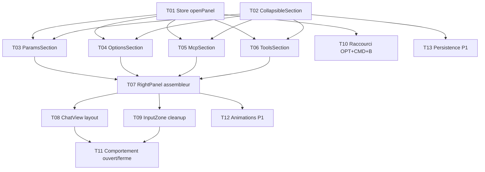

# Taches — Right Panel

**Date** : 2026-03-22
**Nombre de taches** : 11
**Phases** : P0 (11 taches), P1 (2 taches)

## Taches

### T01 · Store openPanel + workspace alias

**Phase** : P0
**But** : Creer le state `openPanel` dans ui.store pour gerer l'exclusivite mutuelle right panel / workspace

**Fichiers concernes** :
- `[MODIFY]` `src/renderer/src/stores/ui.store.ts` — ajouter `openPanel: 'workspace' | 'right' | null`, `toggleRightPanel()`, `setOpenPanel()`
- `[MODIFY]` `src/renderer/src/stores/workspace.store.ts` — `togglePanel()` et `isPanelOpen` deviennent des alias qui delegent a `ui.store.openPanel`

**Piste** : frontend

**Dependances** : aucune

**Criteres d'acceptation** :
- [ ] `openPanel` gere 3 etats : `'workspace'`, `'right'`, `null`
- [ ] `toggleRightPanel()` : si `openPanel === 'right'` → `null`, sinon → `'right'`
- [ ] Ouvrir le workspace (`openPanel = 'workspace'`) ferme le right panel et vice versa
- [ ] `workspace.store.isPanelOpen` retourne `openPanel === 'workspace'` (retro-compatibilite)
- [ ] `workspace.store.togglePanel()` delegue a `ui.store.setOpenPanel()`
- [ ] Typecheck passe

---

### T02 · Composant CollapsibleSection

**Phase** : P0
**But** : Wrapper generique pour les sections collapsables du Right Panel

**Fichiers concernes** :
- `[NEW]` `src/renderer/src/components/chat/right-panel/CollapsibleSection.tsx`

**Piste** : frontend

**Dependances** : aucune

**Criteres d'acceptation** :
- [ ] Props : `title: string`, `icon: LucideIcon`, `defaultOpen?: boolean`, `children: ReactNode`
- [ ] Header cliquable avec titre, icone, chevron (ChevronDown/ChevronRight)
- [ ] Toggle open/close via useState local
- [ ] Style coherent : texte muted, espacement uniforme, separator en bas
- [ ] Typecheck passe

---

### T03 · ParamsSection

**Phase** : P0
**But** : Section non collapsable avec les parametres principaux du chat (modele, reflexion, role, web search, tokens/cout)

**Fichiers concernes** :
- `[NEW]` `src/renderer/src/components/chat/right-panel/ParamsSection.tsx`

**Piste** : frontend

**Dependances** : T01, T02

**Criteres d'acceptation** :
- [ ] Affiche ModelSelector (meme composant que dans InputZone)
- [ ] Affiche ThinkingSelector / ChatOptionsMenu (thinking effort + web search toggle)
- [ ] Affiche RoleSelector (disable si conversation en cours avec messages)
- [ ] Affiche toggle Web Search avec switch
- [ ] Affiche tokens courants / max tokens + cout total de la conversation (texte calcule, meme logique que ContextWindowIndicator)
- [ ] Section NON collapsable (pas de CollapsibleSection wrapper)
- [ ] Icone section : Settings (lucide-react)
- [ ] Lit les stores : providers, settings, roles, conversations, messages
- [ ] Typecheck passe

---

### T04 · OptionsSection

**Phase** : P0
**But** : Section collapsable avec les options secondaires (prompt, library, YOLO)

**Fichiers concernes** :
- `[NEW]` `src/renderer/src/components/chat/right-panel/OptionsSection.tsx`

**Piste** : frontend

**Dependances** : T01, T02

**Criteres d'acceptation** :
- [ ] Wrappe dans CollapsibleSection avec titre "Options", icone Sliders (lucide-react), defaultOpen=true
- [ ] Affiche PromptPicker (selection de prompt template)
- [ ] Affiche LibraryPicker (selection de referentiel sticky)
- [ ] Affiche YoloToggle (activation mode sandbox)
- [ ] Chaque controle sur sa propre ligne (layout vertical, pas horizontal comme dans la toolbar)
- [ ] Typecheck passe

---

### T05 · McpSection

**Phase** : P0
**But** : Section collapsable listant les serveurs MCP avec toggle on/off individuel

**Fichiers concernes** :
- `[NEW]` `src/renderer/src/components/chat/right-panel/McpSection.tsx`

**Piste** : frontend

**Dependances** : T01, T02

**Criteres d'acceptation** :
- [ ] Wrappe dans CollapsibleSection avec titre "MCP", icone Plug (lucide-react), defaultOpen=true
- [ ] Liste les serveurs MCP depuis le store/IPC existant
- [ ] Chaque serveur : nom + Switch on/off (toggle global, meme comportement qu'actuellement)
- [ ] Indicateur de statut (pastille verte si connecte, grise sinon)
- [ ] Max 5 serveurs visibles, scrollbar au-dela (max-h fixe + overflow-y-auto)
- [ ] Si 0 MCP configure : afficher "Aucun serveur MCP" en texte muted
- [ ] Typecheck passe

---

### T06 · ToolsSection

**Phase** : P0
**But** : Section collapsable avec 4 boutons outils en grille 2x2

**Fichiers concernes** :
- `[NEW]` `src/renderer/src/components/chat/right-panel/ToolsSection.tsx`

**Piste** : frontend

**Dependances** : T01, T02

**Criteres d'acceptation** :
- [ ] Wrappe dans CollapsibleSection avec titre "Outils", icone Wrench (lucide-react), defaultOpen=true
- [ ] Grille 2x2 (grid grid-cols-2 gap-2)
- [ ] 4 boutons icone-only + tooltip :
  - Telegram (Send icon) — appelle le start/stop remote Telegram. Grise si bot non configure
  - Resume (FileText icon) — appelle `window.api.summarizeConversation()`. Grise si pas de messages
  - Ameliorer le prompt (Sparkles icon) — appelle `handleOptimizePrompt()`. Grise si textarea vide
  - Fork (GitFork icon) — appelle `window.api.forkConversation()`. Grise si pas de conversation active
- [ ] Boutons : variante ghost, taille fixe, border subtle, hover highlight
- [ ] Chaque bouton grise (opacity + cursor-not-allowed) quand son action est indisponible
- [ ] Typecheck passe

---

### T07 · RightPanel assembleur

**Phase** : P0
**But** : Composant principal qui assemble les 4 sections

**Fichiers concernes** :
- `[NEW]` `src/renderer/src/components/chat/right-panel/RightPanel.tsx`

**Piste** : frontend

**Dependances** : T03, T04, T05, T06

**Criteres d'acceptation** :
- [ ] Layout vertical (flex col) avec les 4 sections espacees
- [ ] Largeur fixe `w-[260px]` (identique a la sidebar)
- [ ] Fond : meme couleur que le fond du chat (bg-background), pas de background propre
- [ ] Bordure gauche subtile (border-l border-border/40)
- [ ] Hauteur : h-full, overflow-y-auto si contenu deborde
- [ ] shrink-0 (ne se comprime pas)
- [ ] Ordre : ParamsSection → OptionsSection → McpSection → ToolsSection
- [ ] Typecheck passe

---

### T08 · ChatView layout mutuellement exclusif

**Phase** : P0
**But** : Integrer le RightPanel dans ChatView, mutuellement exclusif avec WorkspacePanel

**Fichiers concernes** :
- `[MODIFY]` `src/renderer/src/components/chat/ChatView.tsx`

**Piste** : frontend

**Dependances** : T07

**Criteres d'acceptation** :
- [ ] Lit `openPanel` depuis ui.store
- [ ] Si `openPanel === 'right'` → affiche `<RightPanel />`
- [ ] Si `openPanel === 'workspace'` et `workspaceRootPath` → affiche `<WorkspacePanel />`
- [ ] Jamais les deux en meme temps
- [ ] Si `openPanel === null` → aucun panneau lateral
- [ ] Le bouton toggle du right panel est dans la zone header/toolbar du chat (a definir — peut etre un bouton dans l'InputZone simplifie)
- [ ] Mode Arena (`currentView === 'arena'`) → pas de RightPanel
- [ ] Typecheck passe

---

### T09 · InputZone cleanup

**Phase** : P0
**But** : Retirer tous les controles migres vers le Right Panel de l'InputZone

**Fichiers concernes** :
- `[MODIFY]` `src/renderer/src/components/chat/InputZone.tsx`

**Piste** : frontend

**Dependances** : T07

**Criteres d'acceptation** :
- [ ] Retirer de la toolbar : ModelSelector, ChatOptionsMenu, RoleSelector, LibraryPicker, YoloToggle, PromptPicker, Sparkles (optimizer), Fork button
- [ ] Conserver dans la toolbar : Paperclip (piece jointe a gauche), VoiceInput (micro), Send/Cancel (a droite)
- [ ] Retirer le ContextWindowIndicator du bas
- [ ] Retirer le hint clavier du bas (ou le garder si pertinent)
- [ ] Retirer les badges Remote/Web du bas (plus affiches nulle part)
- [ ] Le bouton workspace (FolderOpen) reste dans la toolbar OU est deplace — a evaluer
- [ ] Les imports inutilises sont nettoyes
- [ ] Le `handleSendText()` continue de fonctionner (il lit les stores, pas les composants)
- [ ] @mentions et slash commands restent fonctionnels dans le textarea
- [ ] Typecheck passe

---

### T10 · Raccourci OPT+CMD+B

**Phase** : P0
**But** : Ajouter le raccourci clavier pour toggle le Right Panel

**Fichiers concernes** :
- `[MODIFY]` `src/renderer/src/hooks/useKeyboardShortcuts.ts`

**Piste** : frontend

**Dependances** : T01

**Criteres d'acceptation** :
- [ ] OPT+CMD+B (macOS) / Alt+Ctrl+B (autres) → toggle right panel via `toggleRightPanel()`
- [ ] CMD+B reste inchange (toggle sidebar — NE PAS changer le comportement existant)
- [ ] Les deux raccourcis fonctionnent simultanement sans conflit
- [ ] Typecheck passe

---

### T11 · Comportement ouverture/fermeture automatique

**Phase** : P0
**But** : Le Right Panel s'ouvre auto sur nouvelle conversation, se ferme au switch

**Fichiers concernes** :
- `[MODIFY]` `src/renderer/src/components/chat/ChatView.tsx` (ou le hook/store pertinent)

**Piste** : frontend

**Dependances** : T08, T09

**Criteres d'acceptation** :
- [ ] Quand une nouvelle conversation est creee → `openPanel = 'right'`
- [ ] Quand on switch vers une conversation existante → `openPanel = null` (si le right panel etait ouvert)
- [ ] Le workspace panel n'est pas affecte par cette logique (s'il etait ouvert manuellement, il reste)
- [ ] Pas de flash/clignotement lors du switch
- [ ] Typecheck passe

---

### T12 · Animations de transition (P1)

**Phase** : P1
**But** : Transition smooth a l'ouverture/fermeture du Right Panel

**Fichiers concernes** :
- `[MODIFY]` `src/renderer/src/components/chat/right-panel/RightPanel.tsx`

**Piste** : frontend

**Dependances** : T07

**Criteres d'acceptation** :
- [ ] Transition width 200ms ease-out (meme pattern que WorkspacePanel)
- [ ] Pas de saut de layout sur le chat (le flex-1 absorbe)
- [ ] Typecheck passe

---

### T13 · Persistence sections collapse (P1)

**Phase** : P1
**But** : Persister l'etat ouvert/ferme des sections collapsables entre sessions

**Fichiers concernes** :
- `[MODIFY]` `src/renderer/src/stores/settings.store.ts` — ajouter `rightPanelSections: Record<string, boolean>`
- `[MODIFY]` `src/renderer/src/components/chat/right-panel/CollapsibleSection.tsx`

**Piste** : frontend

**Dependances** : T02

**Criteres d'acceptation** :
- [ ] L'etat ouvert/ferme de chaque section survit au reload (Zustand persist localStorage)
- [ ] Valeurs par defaut : toutes les sections ouvertes
- [ ] Typecheck passe

---

## Graphe de dependances

## Indicateurs de parallelisme

### Pistes identifiees
| Piste | Taches | Repertoire |
|-------|--------|------------|
| store | T01, T10 | stores/, hooks/ |
| composants | T02, T03, T04, T05, T06 | components/chat/right-panel/ |
| integration | T07, T08, T09, T11 | components/chat/ |

### Fichiers partages entre pistes
| Fichier | Taches | Risque de conflit |
|---------|--------|-------------------|
| ui.store.ts | T01, T08, T11 | Faible (T01 ajoute, T08/T11 lisent) |
| ChatView.tsx | T08, T11 | Moyen (meme fichier, sections differentes) |
| InputZone.tsx | T09 | Aucun (seul a le modifier) |
| useKeyboardShortcuts.ts | T10 | Aucun (seul a le modifier) |

### Chemin critique
T01 → T03 → T07 → T08 → T11
