# Plan de developpement — sandbox-yolo

**Date** : 2026-03-21
**Contexte** : architecture-technique.md, architecture-fonctionnelle.md

## Vue d'ensemble

```
┌─────────────────────────────────────────────────────────┐
│                      Renderer (React)                    │
│                                                          │
│  ┌──────────┐  ┌──────────────┐  ┌───────────────────┐  │
│  │YoloToggle│  │YoloStatusBar │  │  ProcessList      │  │
│  │(warning) │  │(path,procs)  │  │  (kill individuel)│  │
│  └────┬─────┘  └──────┬───────┘  └────────┬──────────┘  │
│       │               │                    │             │
│  ┌────┴───────────────┴────────────────────┴──────┐      │
│  │              sandbox.store.ts (Zustand)         │      │
│  └────────────────────┬───────────────────────────┘      │
│                       │ IPC                               │
├───────────────────────┼──────────────────────────────────┤
│                       │ Main Process                      │
│  ┌────────────────────┴──────────────────────┐           │
│  │           sandbox.ipc.ts (6 handlers)      │           │
│  └────────┬──────────────────┬───────────────┘           │
│           │                  │                            │
│  ┌────────┴───────┐  ┌──────┴──────────────┐            │
│  │SandboxService  │  │ProcessManagerService│            │
│  │(dirs, seatbelt)│  │(track, kill, cleanup│            │
│  └────────┬───────┘  └──────┬──────────────┘            │
│           │                  │                            │
│  ┌────────┴───────┐  ┌──────┴──────────┐                │
│  │  seatbelt.ts   │  │ yolo-tools.ts   │                │
│  │  (SBPL profile)│  │ (5 AI SDK tools)│                │
│  └────────────────┘  └─────────────────┘                │
│                                                          │
│  chat.ipc.ts ← detecte mode YOLO → injecte yolo-tools   │
│                                    + yolo-prompt          │
└──────────────────────────────────────────────────────────┘
```

## Structure du projet (nouveaux fichiers)

```
src/main/
  services/
    sandbox.service.ts            # [NEW] ~200 lignes
    process-manager.service.ts    # [NEW] ~150 lignes
    seatbelt.ts                   # [NEW] ~100 lignes
  llm/
    yolo-tools.ts                 # [NEW] ~250 lignes
    yolo-prompt.ts                # [NEW] ~50 lignes
  ipc/
    sandbox.ipc.ts                # [NEW] ~120 lignes
  db/
    schema.ts                     # [MODIFY] +2 colonnes conversations
    queries/
      conversations.ts            # [MODIFY] +setConversationYolo, +setSandboxPath

src/preload/
  index.ts                        # [MODIFY] +6 methodes sandbox
  types.ts                        # [MODIFY] +SandboxInfo, +ProcessInfo types

src/renderer/src/
  stores/
    sandbox.store.ts              # [NEW] ~80 lignes
  components/chat/
    YoloToggle.tsx                # [NEW] ~100 lignes
    YoloStatusBar.tsx             # [NEW] ~80 lignes
    ProcessList.tsx               # [NEW] ~60 lignes
  components/chat/InputZone.tsx   # [MODIFY] +YoloToggle integration
  components/chat/ChatView.tsx    # [MODIFY] +YoloStatusBar integration

src/main/llm/
  registry.ts                     # [MODIFY] +supportsYolo champ
  workspace-tools.ts              # [MODIFY] (pas de changement, reference seulement)

src/main/index.ts                 # [MODIFY] +cleanup process orphelins au startup
src/main/ipc/chat.ipc.ts          # [MODIFY] +branche YOLO dans handleChatMessage
```

## Modele de donnees

### Colonnes ajoutees sur `conversations`
```
is_yolo       INTEGER DEFAULT 0  -- boolean
sandbox_path  TEXT               -- chemin du dossier sandbox (null si Normal)
```

### Migration (dans migrate.ts)
```sql
ALTER TABLE conversations ADD COLUMN is_yolo INTEGER DEFAULT 0;
ALTER TABLE conversations ADD COLUMN sandbox_path TEXT;
CREATE INDEX IF NOT EXISTS idx_conversations_is_yolo ON conversations(is_yolo);
```

## Integration chat.ipc.ts

Le handler `handleChatMessage()` detecte le mode YOLO sur la conversation :
- Si `is_yolo` → utilise `buildYoloTools()` au lieu de `buildWorkspaceTools()`
- Injecte `YOLO_SYSTEM_PROMPT` (plan-then-execute) avant le system prompt existant
- Augmente `stopWhen: stepCountIs(MAX_YOLO_STEPS)` (defaut 50 au lieu de 50 existant mais semantiquement different)
- Le streaming reste identique (memes chunks IPC `chat:chunk`)

## Phases de developpement

### P0 — MVP

| # | Tache | Detail |
|---|-------|--------|
| 1 | SandboxService | Singleton, create/cleanup dirs, profil Seatbelt dynamique |
| 2 | ProcessManagerService | Singleton, track/killAll/killOne, SIGTERM→SIGKILL grace period |
| 3 | seatbelt.ts | Profil SBPL, wrapper sandbox-exec, detection OS |
| 4 | yolo-tools.ts | 5 tools AI SDK (bash, createFile, readFile, listFiles, openPreview) |
| 5 | yolo-prompt.ts | System prompt YOLO |
| 6 | sandbox.ipc.ts | 6 handlers IPC (Zod) |
| 7 | DB migration | +is_yolo, +sandbox_path, +index |
| 8 | chat.ipc.ts integration | Branche YOLO |
| 9 | Preload | +6 methodes |
| 10 | sandbox.store.ts | State Zustand YOLO |
| 11 | YoloToggle.tsx | Toggle + warning modal |
| 12 | YoloStatusBar.tsx | Barre status + Stop |
| 13 | Integration InputZone/ChatView | Branchement composants |
| 14 | registry.ts | +supportsYolo champ |
| 15 | Cleanup startup | Process orphelins au boot |

### P1 — Confort

| # | Tache | Detail |
|---|-------|--------|
| 16 | Preview amelioree | Detection type fichier, ouverture intelligente |
| 17 | ProcessList.tsx | Liste processes avec kill individuel |
| 18 | Filesystem isolation Windows | realpathSync + confinement sans Seatbelt |
| 19 | Timeout global configurable | Settings UI + logique main |
| 20 | Step limit configurable | Settings UI + logique main |

### P2 — Nice-to-have

| # | Tache | Detail |
|---|-------|--------|
| 21 | installDeps tool | npm install / pip install confines |
| 22 | Modeles eligibles configurables | UI settings pour ajouter/retirer des modeles |
| 23 | bubblewrap Linux | Profil bwrap (hors scope v1 — stub uniquement) |

## Tests

- **Seatbelt** : test unitaire avec profil restrictif → verifier deny sur /etc, deny network, allow sandbox dir
- **ProcessManager** : test lifecycle (track, kill, killAll, grace period)
- **yolo-tools** : test chaque tool isolement (createFile respecte sandboxDir, bash confine)
- **Integration** : test flow complet (activate → send → tool calls → stop → cleanup)
- **Regression** : verifier que le mode Normal n'est pas affecte

## Ordre d'execution

```mermaid
gantt
    title sandbox-yolo — Phases
    dateFormat X
    axisFormat %s

    section Backend Core
    T01 SandboxService         :t01, 0, 2
    T02 ProcessManager         :t02, 0, 2
    T03 seatbelt.ts            :t03, 0, 1
    T04 yolo-tools.ts          :t04, after t01, 2
    T05 yolo-prompt.ts         :t05, 0, 1
    T06 sandbox.ipc.ts         :t06, after t01 t02, 2
    T07 DB migration           :t07, 0, 1
    T08 chat.ipc.ts            :t08, after t04 t06, 2

    section Frontend
    T09 Preload                :t09, after t06, 1
    T10 sandbox.store.ts       :t10, after t09, 1
    T11 YoloToggle             :t11, after t10, 1
    T12 YoloStatusBar          :t12, after t10, 1
    T13 Integration ChatView   :t13, after t11 t12, 1

    section Finition
    T14 registry.ts            :t14, 0, 1
    T15 Cleanup startup        :t15, after t02, 1
```



## Checklist de lancement

- [ ] Profil Seatbelt teste sur macOS Tahoe
- [ ] ProcessManager kill proprement tous les process enfants
- [ ] Mode Normal non affecte (pas de regression)
- [ ] Warning YOLO s'affiche et requiert confirmation
- [ ] Stop button kill tout et restore l'etat
- [ ] Changement de conversation cleanup les process
- [ ] Quit app cleanup les process
- [ ] Step limit empeche les boucles infinies
- [ ] Fichiers confines au sandbox dir
- [ ] Reseau confine au loopback (macOS)
- [ ] Typecheck 0 erreurs renderer + main
