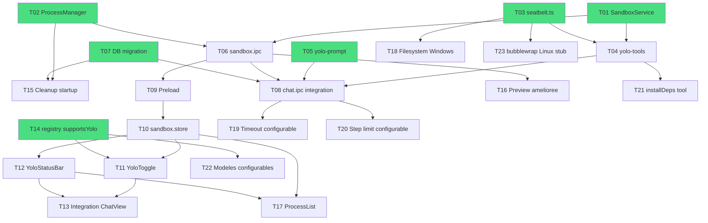

# Taches — sandbox-yolo

**Date** : 2026-03-21
**Nombre de taches** : 23
**Phases** : P0 (15 taches), P1 (5 taches), P2 (3 taches)

## Taches

### T01 · SandboxService

**Phase** : P0
**But** : Service singleton gerant le lifecycle des dossiers sandbox et la generation de profils Seatbelt

**Fichiers concernes** :
- `[NEW]` `src/main/services/sandbox.service.ts`

**Piste** : backend

**Dependances** : aucune

**Securite** : Generation du profil SBPL avec substitution `SANDBOX_DIR` securisee (pas d'injection dans le profil)

**Criteres d'acceptation** :
- [ ] `createSession(workspacePath?)` → cree le dossier sandbox (`~/cruchot/sandbox/[UUID]` ou workspace path)
- [ ] `destroySession(sessionId)` → supprime le dossier sandbox (trash, pas rm)
- [ ] `getSandboxDir(sessionId)` → retourne le chemin absolu
- [ ] `generateSeatbeltProfile(sandboxDir)` → retourne le profil SBPL avec paths substitues
- [ ] `isActive(sessionId)` → boolean
- [ ] Singleton pattern (`export const sandboxService = new SandboxService()`)
- [ ] Le dossier `~/cruchot/sandbox/` est cree au premier usage (mkdirSync recursive)

---

### T02 · ProcessManagerService

**Phase** : P0
**But** : Service singleton traquant tous les process enfants par session, avec kill propre (SIGTERM→SIGKILL)

**Fichiers concernes** :
- `[NEW]` `src/main/services/process-manager.service.ts`

**Piste** : backend

**Dependances** : aucune

**Criteres d'acceptation** :
- [ ] `track(sessionId, childProcess, meta)` → enregistre un process dans la Map
- [ ] `killOne(sessionId, pid)` → SIGTERM, 3s grace, SIGKILL si toujours vivant
- [ ] `killAll(sessionId)` → kill tous les process de la session
- [ ] `killGlobal()` → kill tous les process de toutes les sessions
- [ ] `getProcesses(sessionId)` → liste des process actifs (pid, command, type, port, startedAt)
- [ ] `onProcessExit(sessionId, pid)` → cleanup automatique de la Map
- [ ] Max 5 process simultanes par session (rejette au-dela)
- [ ] Kill par groupe de process (`process.kill(-pid, signal)`) pour tuer l'arbre complet
- [ ] Singleton pattern

---

### T03 · Seatbelt wrapper

**Phase** : P0
**But** : Module utilitaire pour executer des commandes sous sandbox-exec (macOS) avec profil SBPL

**Fichiers concernes** :
- `[NEW]` `src/main/services/seatbelt.ts`

**Piste** : backend

**Dependances** : aucune

**Criteres d'acceptation** :
- [ ] `isSeatbeltAvailable()` → verifie que `/usr/bin/sandbox-exec` existe (macOS only)
- [ ] `execSandboxed(command, sandboxDir, options)` → wrappe `exec()` avec `sandbox-exec -p "profile"`
- [ ] Le profil SBPL est genere dynamiquement avec le `sandboxDir` substitue
- [ ] Fallback sur `exec()` classique si Seatbelt non disponible (Windows, Linux, macOS sans sandbox-exec)
- [ ] Env minimal : PATH, HOME (sandbox dir), TMPDIR, LANG, FORCE_COLOR=0, NO_COLOR=1
- [ ] Timeout configurable (defaut 30s pour scripts, 0 pour serveurs)
- [ ] Detection OS via `process.platform`

---

### T04 · yolo-tools.ts

**Phase** : P0
**But** : Set de 5 tools AI SDK pour le mode YOLO (bash debride, fichiers, preview)

**Fichiers concernes** :
- `[NEW]` `src/main/llm/yolo-tools.ts`

**Piste** : backend

**Dependances** : T01, T02, T03

**Securite** : Tous les chemins de fichiers valides via `realpathSync` + `startsWith(sandboxDir)`. Bash execute sous Seatbelt.

**Criteres d'acceptation** :
- [ ] `buildYoloTools(sandboxService, processManager, sessionId)` retourne 5 tools AI SDK v6
- [ ] Tool `bash` : execute via `execSandboxed()`, pas de blocklist (mode YOLO), timeout 60s, output max 100KB
- [ ] Tool `createFile` : cree un fichier dans le sandbox dir, cree les repertoires parents, max 10MB, valide le chemin (`realpathSync + startsWith`)
- [ ] Tool `readFile` : lit un fichier dans le sandbox dir, max 5MB, valide le chemin
- [ ] Tool `listFiles` : liste les fichiers/dossiers dans le sandbox dir
- [ ] Tool `openPreview` : appelle `shell.openExternal(url_or_path)` pour ouvrir dans le navigateur/app OS par defaut. Si port specifie, ouvre `http://localhost:PORT`
- [ ] Chaque tool utilise `inputSchema` (Zod) conformement a AI SDK v6
- [ ] Le tool bash track le process via ProcessManager si `type: 'server'` (long-running)

---

### T05 · yolo-prompt.ts

**Phase** : P0
**But** : System prompt specifique au mode YOLO qui guide le LLM vers un flow plan-then-execute

**Fichiers concernes** :
- `[NEW]` `src/main/llm/yolo-prompt.ts`

**Piste** : backend

**Dependances** : aucune

**Criteres d'acceptation** :
- [ ] `YOLO_SYSTEM_PROMPT` : constante string injectee dans le system prompt quand mode YOLO actif
- [ ] Le prompt indique au LLM : (1) montrer un plan d'abord, (2) attendre approbation, (3) executer step-by-step, (4) s'arreter quand c'est termine
- [ ] Le prompt liste les tools disponibles et leurs contraintes
- [ ] Le prompt indique le `sandboxDir` comme repertoire de travail
- [ ] Le prompt interdit les operations hors du sandbox dir

---

### T06 · sandbox.ipc.ts

**Phase** : P0
**But** : 6 handlers IPC pour le mode YOLO (activate, deactivate, stop, status, processes, preview)

**Fichiers concernes** :
- `[NEW]` `src/main/ipc/sandbox.ipc.ts`

**Piste** : backend

**Dependances** : T01, T02

**Securite** : Tous les handlers valides par Zod. `openPreview` valide l'URL/path avant `shell.openExternal`.

**Criteres d'acceptation** :
- [ ] `sandbox:activate` → cree une session sandbox, retourne `{ sessionId, sandboxPath }`
- [ ] `sandbox:deactivate` → detruit la session, kill tous les process
- [ ] `sandbox:stop` → kill tous les process de la session (sans detruire le dossier)
- [ ] `sandbox:getStatus` → retourne `{ isActive, sessionId, sandboxPath }`
- [ ] `sandbox:getProcesses` → retourne la liste des process actifs
- [ ] `sandbox:openPreview` → ouvre un fichier/URL via `shell.openExternal` (valide le path d'abord)
- [ ] Tous les payloads valides par Zod
- [ ] Enregistre dans `src/main/ipc/index.ts`

---

### T07 · DB migration

**Phase** : P0
**But** : Ajouter les colonnes `is_yolo` et `sandbox_path` sur la table `conversations`

**Fichiers concernes** :
- `[MODIFY]` `src/main/db/schema.ts`
- `[MODIFY]` `src/main/db/migrate.ts`
- `[MODIFY]` `src/main/db/queries/conversations.ts`

**Piste** : backend

**Dependances** : aucune

**Criteres d'acceptation** :
- [ ] Schema Drizzle : `is_yolo` INTEGER DEFAULT 0 (mode boolean), `sandbox_path` TEXT nullable
- [ ] Migration idempotente `ALTER TABLE ... ADD COLUMN` (try/catch comme les autres)
- [ ] Index `idx_conversations_is_yolo`
- [ ] Query `setConversationYolo(id, isYolo, sandboxPath?)` via Drizzle
- [ ] Query `getYoloConversations()` pour cleanup au startup

---

### T08 · Integration chat.ipc.ts

**Phase** : P0
**But** : Brancher le mode YOLO dans le handler `handleChatMessage()` existant

**Fichiers concernes** :
- `[MODIFY]` `src/main/ipc/chat.ipc.ts`

**Piste** : backend

**Dependances** : T04, T05, T06, T07

**Criteres d'acceptation** :
- [ ] Detecte `is_yolo` sur la conversation courante
- [ ] Si YOLO : utilise `buildYoloTools()` au lieu de `buildWorkspaceTools()`
- [ ] Si YOLO : injecte `YOLO_SYSTEM_PROMPT` dans le system prompt (en premier)
- [ ] Si YOLO : augmente `stopWhen: stepCountIs(MAX_YOLO_STEPS)` (setting configurable, defaut 50)
- [ ] Le streaming reste identique (memes chunks IPC `chat:chunk`)
- [ ] Le mode Normal n'est PAS affecte (zero regression)
- [ ] Les tool-call/tool-result chunks sont forward normalement (le ToolCallBlock existant les affiche)

---

### T09 · Preload sandbox

**Phase** : P0
**But** : Exposer 6 methodes sandbox dans le contextBridge

**Fichiers concernes** :
- `[MODIFY]` `src/preload/index.ts`
- `[MODIFY]` `src/preload/types.ts`

**Piste** : fullstack

**Dependances** : T06

**Criteres d'acceptation** :
- [ ] `sandboxActivate(conversationId, workspacePath?)` → `ipcRenderer.invoke('sandbox:activate', ...)`
- [ ] `sandboxDeactivate(sessionId)` → `ipcRenderer.invoke('sandbox:deactivate', ...)`
- [ ] `sandboxStop(sessionId)` → `ipcRenderer.invoke('sandbox:stop', ...)`
- [ ] `sandboxGetStatus(conversationId)` → `ipcRenderer.invoke('sandbox:getStatus', ...)`
- [ ] `sandboxGetProcesses(sessionId)` → `ipcRenderer.invoke('sandbox:getProcesses', ...)`
- [ ] `sandboxOpenPreview(pathOrUrl)` → `ipcRenderer.invoke('sandbox:openPreview', ...)`
- [ ] Types : `SandboxInfo { sessionId, sandboxPath, isActive }`, `ProcessInfo { pid, command, type, port?, startedAt }`

---

### T10 · sandbox.store.ts

**Phase** : P0
**But** : Store Zustand pour l'etat du mode YOLO dans le renderer

**Fichiers concernes** :
- `[NEW]` `src/renderer/src/stores/sandbox.store.ts`

**Piste** : frontend

**Dependances** : T09

**Criteres d'acceptation** :
- [ ] State : `isActive`, `sessionId`, `sandboxPath`, `processes` (ProcessInfo[])
- [ ] Actions : `activate(conversationId, workspacePath?)`, `deactivate()`, `stop()`, `refreshProcesses()`, `reset()`
- [ ] Appelle les methodes preload correspondantes
- [ ] Reset au changement de conversation

---

### T11 · YoloToggle.tsx

**Phase** : P0
**But** : Toggle pour activer/desactiver le mode YOLO avec warning dissuasif

**Fichiers concernes** :
- `[NEW]` `src/renderer/src/components/chat/YoloToggle.tsx`

**Piste** : frontend

**Dependances** : T10

**Criteres d'acceptation** :
- [ ] Toggle switch (shadcn Switch ou bouton custom)
- [ ] Desactive si le modele courant n'est pas compatible YOLO (`supportsYolo`)
- [ ] A l'activation : affiche un Dialog/modal de warning avec texte dissuasif (risques, pas de garantie, responsabilite utilisateur)
- [ ] Le warning requiert un clic explicite "J'accepte les risques" (pas juste fermer)
- [ ] Indicateur visuel quand YOLO actif (couleur, icone, badge)
- [ ] Tooltip "Modele non compatible" si desactive

---

### T12 · YoloStatusBar.tsx

**Phase** : P0
**But** : Barre de statut sandbox affichee sous le header quand le mode YOLO est actif

**Fichiers concernes** :
- `[NEW]` `src/renderer/src/components/chat/YoloStatusBar.tsx`

**Piste** : frontend

**Dependances** : T10

**Criteres d'acceptation** :
- [ ] Affiche le chemin du sandbox dir (tronque si trop long)
- [ ] Affiche le nombre de process actifs
- [ ] Bouton "Stop" (rouge) qui kill tous les process
- [ ] Bouton "Open Folder" qui ouvre le dossier sandbox dans le Finder
- [ ] Cache quand mode YOLO inactif
- [ ] Style : barre discrete, couleur d'accent (orange/amber pour signaler le mode dangereux)

---

### T13 · Integration InputZone + ChatView

**Phase** : P0
**But** : Integrer YoloToggle dans InputZone et YoloStatusBar dans ChatView

**Fichiers concernes** :
- `[MODIFY]` `src/renderer/src/components/chat/InputZone.tsx`
- `[MODIFY]` `src/renderer/src/components/chat/ChatView.tsx`

**Piste** : frontend

**Dependances** : T11, T12

**Criteres d'acceptation** :
- [ ] YoloToggle place dans la zone pills de InputZone (a cote de ThinkingSelector)
- [ ] YoloStatusBar place dans ChatView, entre le header et la zone de messages
- [ ] Le Stop button de YoloStatusBar est accessible pendant le streaming
- [ ] Le changement de conversation appelle `sandboxStore.reset()` + kill process precedents

---

### T14 · registry.ts — supportsYolo

**Phase** : P0
**But** : Ajouter le champ `supportsYolo` sur ModelDefinition pour filtrer les modeles eligibles

**Fichiers concernes** :
- `[MODIFY]` `src/main/llm/registry.ts`
- `[MODIFY]` `src/main/llm/types.ts` (si le type est ici)

**Piste** : backend

**Dependances** : aucune

**Criteres d'acceptation** :
- [ ] Champ `supportsYolo: boolean` ajoute a `ModelDefinition`
- [ ] `true` pour : Claude Opus 4.6, Sonnet 4.6, GPT-5.4, GPT-5.3 Codex, GPT-5 Mini, Gemini 3.1 Pro, Gemini 3 Flash, Magistral Medium, Devstral 2, Mistral Large 3, Grok 4.1 Fast Reasoning, Qwen3 Max, Qwen3.5 Plus
- [ ] `true` pour tous les modeles OpenRouter, LM Studio, Ollama (l'utilisateur sait ce qu'il fait)
- [ ] `false` pour : Haiku 4.5, DeepSeek Chat, DeepSeek Reasoner, GPT-5 Nano, Perplexity Sonar, modeles image
- [ ] Type exporte pour que le renderer puisse filtrer

---

### T15 · Cleanup process orphelins au startup

**Phase** : P0
**But** : Au demarrage de l'app, scanner et nettoyer les process orphelins d'un crash precedent

**Fichiers concernes** :
- `[MODIFY]` `src/main/index.ts`

**Piste** : backend

**Dependances** : T02, T07

**Criteres d'acceptation** :
- [ ] Au startup, query `getYoloConversations()` avec `sandbox_path` non null
- [ ] Pour chaque conversation YOLO orpheline : verifier si le dossier existe, scanner les PIDs
- [ ] Reset `is_yolo = 0` et `sandbox_path = null` sur les conversations orphelines
- [ ] Log les cleanups effectues
- [ ] Execute apres `createMainWindow()` (deferred init pattern existant)

---

### T16 · Preview amelioree

**Phase** : P1
**But** : Detection intelligente du type de fichier pour ouvrir avec la bonne app OS

**Fichiers concernes** :
- `[MODIFY]` `src/main/ipc/sandbox.ipc.ts`

**Piste** : backend

**Dependances** : T06

**Criteres d'acceptation** :
- [ ] Fichier `.html` → ouvre dans le navigateur par defaut
- [ ] URL `http://localhost:PORT` → ouvre dans le navigateur
- [ ] Fichier `.py` → execute et affiche la sortie dans le chat (via IPC)
- [ ] Fichier `.md` → ouvre dans l'app par defaut (ou preview markdown)
- [ ] Dossier → ouvre dans le Finder/Explorer
- [ ] Detection automatique du type via extension

---

### T17 · ProcessList.tsx

**Phase** : P1
**But** : Composant affichant la liste des process enfants avec kill individuel

**Fichiers concernes** :
- `[NEW]` `src/renderer/src/components/chat/ProcessList.tsx`

**Piste** : frontend

**Dependances** : T10, T12

**Criteres d'acceptation** :
- [ ] Liste des process actifs (pid, command, type, port, duree)
- [ ] Bouton kill par process (icone X rouge)
- [ ] Indicateur visuel par type (script, server, install)
- [ ] Auto-refresh toutes les 2s via polling IPC
- [ ] Integre dans YoloStatusBar (collapsible)

---

### T18 · Filesystem isolation Windows

**Phase** : P1
**But** : Confinement filesystem pour Windows (fallback sans Seatbelt)

**Fichiers concernes** :
- `[MODIFY]` `src/main/services/seatbelt.ts`

**Piste** : backend

**Dependances** : T03

**Criteres d'acceptation** :
- [ ] Sur Windows (`process.platform === 'win32'`) : `execSandboxed` utilise un env minimal
- [ ] PATH restreint : `C:\Windows\System32;C:\Windows`
- [ ] HOME = sandbox dir
- [ ] USERPROFILE = sandbox dir
- [ ] Validation `realpathSync + startsWith(sandboxDir)` sur chaque operation fichier
- [ ] Tests unitaires Windows (mock `process.platform`)

---

### T19 · Timeout global configurable

**Phase** : P1
**But** : Permettre a l'utilisateur de configurer le timeout global du mode YOLO

**Fichiers concernes** :
- `[MODIFY]` `src/renderer/src/stores/settings.store.ts`
- `[MODIFY]` `src/main/ipc/chat.ipc.ts`

**Piste** : fullstack

**Dependances** : T08

**Criteres d'acceptation** :
- [ ] Setting `yoloTimeoutMinutes` dans settings store (defaut 10)
- [ ] Ajoute a `ALLOWED_SETTING_KEYS`
- [ ] Le handler chat.ipc.ts utilise ce setting pour le timeout AbortController
- [ ] UI dans Settings (input number, min 1, max 60)

---

### T20 · Step limit configurable

**Phase** : P1
**But** : Permettre a l'utilisateur de configurer le step limit du mode YOLO

**Fichiers concernes** :
- `[MODIFY]` `src/renderer/src/stores/settings.store.ts`
- `[MODIFY]` `src/main/ipc/chat.ipc.ts`

**Piste** : fullstack

**Dependances** : T08

**Criteres d'acceptation** :
- [ ] Setting `yoloMaxSteps` dans settings store (defaut 50)
- [ ] Ajoute a `ALLOWED_SETTING_KEYS`
- [ ] Le handler chat.ipc.ts utilise ce setting pour `stopWhen: stepCountIs(N)`
- [ ] UI dans Settings (input number, min 5, max 200)

---

### T21 · installDeps tool

**Phase** : P2
**But** : Tool AI SDK pour installer des dependances (npm install, pip install) dans le sandbox

**Fichiers concernes** :
- `[MODIFY]` `src/main/llm/yolo-tools.ts`

**Piste** : backend

**Dependances** : T04

**Securite** : npm registry doit etre accessible → modifier le profil Seatbelt pour autoriser `registry.npmjs.org` et `pypi.org`

**Criteres d'acceptation** :
- [ ] Tool `installDeps` : detecte le type de projet (package.json → npm, requirements.txt → pip)
- [ ] Execute `npm install` ou `pip install -r requirements.txt` dans le sandbox dir
- [ ] Track le process via ProcessManager (type: 'install')
- [ ] Profil Seatbelt modifie pour autoriser l'acces reseau vers npm/pip registries
- [ ] Timeout 120s (installations longues)

---

### T22 · Modeles eligibles configurables

**Phase** : P2
**But** : Permettre a l'utilisateur d'ajouter/retirer des modeles de la whitelist YOLO

**Fichiers concernes** :
- `[MODIFY]` `src/renderer/src/stores/settings.store.ts`
- `[MODIFY]` `src/renderer/src/components/chat/YoloToggle.tsx`

**Piste** : frontend

**Dependances** : T14

**Criteres d'acceptation** :
- [ ] Setting `yoloModelOverrides` : Map<modelId, boolean> pour forcer/interdire des modeles
- [ ] UI dans Settings pour toggle par modele
- [ ] Le YoloToggle utilise la whitelist combinee (registry + overrides)

---

### T23 · bubblewrap Linux (stub)

**Phase** : P2
**But** : Preparer le support bubblewrap pour Linux (stub sans implementation)

**Fichiers concernes** :
- `[MODIFY]` `src/main/services/seatbelt.ts`

**Piste** : backend

**Dependances** : T03

**Criteres d'acceptation** :
- [ ] Detection `process.platform === 'linux'`
- [ ] Check si `bwrap` est installe (`which bwrap`)
- [ ] Si disponible : log "bubblewrap detected, not yet implemented"
- [ ] Fallback sur filesystem isolation (comme Windows)
- [ ] TODO comments avec la commande bwrap envisagee

---

## Graphe de dependances

## Indicateurs de parallelisme

### Pistes identifiees
| Piste | Taches | Repertoire |
|-------|--------|------------|
| backend-core | T01, T02, T03, T05, T07, T14, T15 | src/main/services/, src/main/llm/, src/main/db/ |
| backend-integration | T04, T06, T08 | src/main/llm/, src/main/ipc/ |
| frontend | T09, T10, T11, T12, T13 | src/preload/, src/renderer/ |

### Fichiers partages entre pistes
| Fichier | Taches | Risque de conflit |
|---------|--------|-------------------|
| src/main/ipc/index.ts | T06, T08 | Faible (ajout de lignes) |
| src/preload/index.ts | T09 | Aucun (seul a le modifier) |
| src/preload/types.ts | T09 | Aucun |
| src/main/ipc/chat.ipc.ts | T08 | Moyen (modification du handler principal) |
| src/main/index.ts | T15 | Faible (ajout deferred init) |

### Chemin critique
T01 → T04 → T08 → (integration complete)
T01 → T06 → T09 → T10 → T11/T12 → T13
